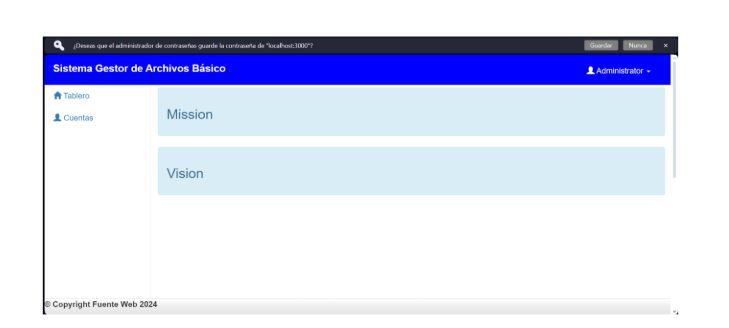
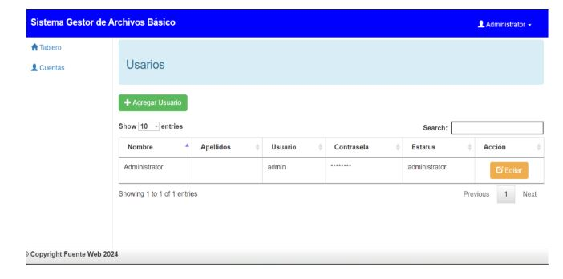
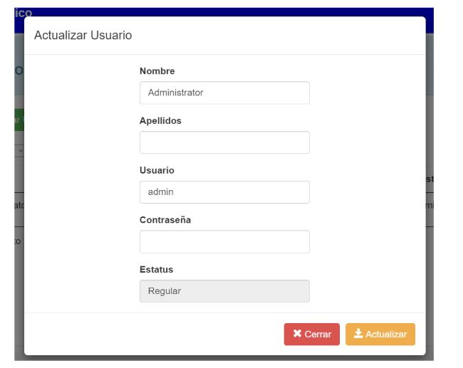
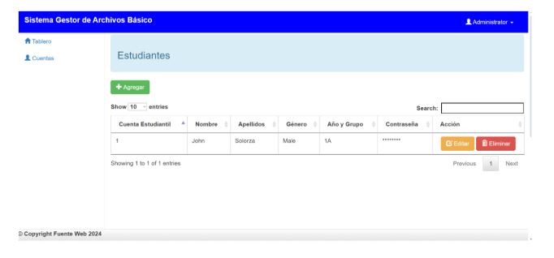
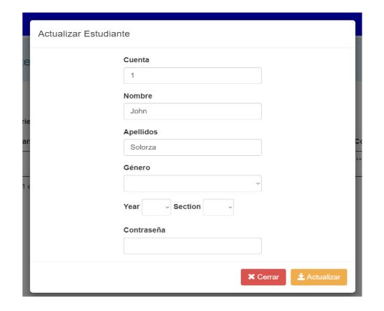
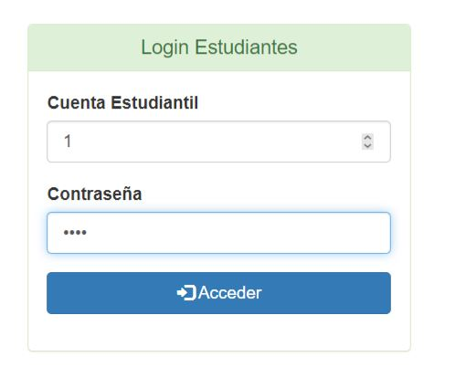
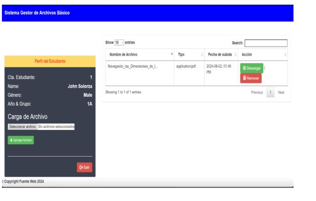
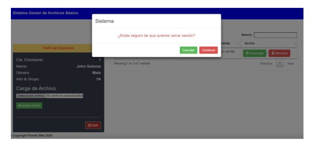

  <h1 align="center" style="color: #eee;">
    :closed_lock_with_key: GESTOR DE ARCHIVOS DOCUMENTAL :closed_lock_with_key:
     
     
    
  </h1>

# TABLA DE CONTENIDO

- [Descripción Funcional](#DESCRIPCIÓN-FUNCIONAL)
- [Mapa de Impacto](#MAPA-DE-IMPACTO)
- [Mapa de Historia de Usuario](#MAPA-DE-HISTORIAS-DE-USUARIO)
- [Historias de Usuarios](#HISTORIAS-DE-USUARIO)
- [Diagrama de Secuencia](#DIAGRAMA-DE-SECUENCIA)
- [Diagrama de Arquitectura](#DIAGRAMA-DE-ARQUITECTURA)
- [Diagrama Modelo Persistencia](#DIAGRAMA-MODELO-PERSISTENCIA)
- [Diagrama Entidad - Relación](#DISEÑO-DEL-MODELO-ENTIDAD-RELACIÓN)
- [Manual de Usuario](#MANUAL-DE-USUARIO)
- [Manual de Administración](#MANUAL-DE-ADMINISTRACIÓN)

## DESCRIPCIÓN FUNCIONAL  :books:
En respuesta a las crecientes necesidades de las empresas en la gestión documental, este proyecto presenta la implementación de una aplicación diseñada específicamente para optimizar estos procesos. Esta herramienta no solo facilita el control de los procedimientos administrativos, sino que también proporciona a clientes y personal interno las herramientas necesarias para agilizar sus tareas diarias. Al digitalizar los historiales documentales, la aplicación reduce significativamente el espacio físico requerido para su almacenamiento y los tiempos de búsqueda de información, mejorando así la eficiencia operativa. Además, ofrece un control más riguroso sobre el flujo de documentos, garantizando un servicio de mayor calidad y una mayor seguridad y estabilidad de los datos.
Para materializar esta visión, se ha adoptado el patrón de diseño MVC, el cual permite una programación más clara y escalable. Además, se utiliza la metodología de desarrollo Java, así como los lenguajes HTML, JavaScript, MySQL y PHP, junto con la contenedorización en Docker. Cada uno de estos elementos se explica detalladamente, facilitando su comprensión y correcta manipulación, lo que asegura la efectividad y sostenibilidad del proyecto.

## MAPA DE IMPACTO
El Mapa de Impacto es una herramienta visual que permitirá en la planificación estratégica del proyecto a alinear las actividades del equipo con los objetivos de negocio y las necesidades de los usuarios. Facilita la identificación de los impactos deseados y las acciones necesarias para alcanzarlos, asegurando que todos los esfuerzos del equipo estén orientados hacia la creación de valor.

  

## MAPA DE HISTORIAS DE USUARIO
El Story Mapping mapa de historia de usuario es una técnica visual utilizada en la gestión de proyectos ágiles para planificar y organizar las tareas necesarias para completar un proyecto. Representa las actividades principales que el usuario realiza al interactuar con el producto y describen funciones o características específicas desde la perspectiva del usuario.

  

## HISTORIAS DE USUARIO
Se construyen las historias de usuario en el tablero de Azure DevOps con la cuenta que ofrece la Universidad. Para visualizar las historias de usuario, se agregan al directorio de Documentos:
[HISTORIAS DE USUARIO](https://github.com/jaiderospina/DEVSECOPS2024/blob/main/BancoProyectos/GRUPO_3/Documentos/GESTOR%20DOCUMENTAL%20HISTORIAS%20DE%20USUARIO.xlsx)
También se dan los permisos necesarios para acceder al tablero de Azure a los integrantes del equipo y al Profesor Jaider a través de la siguiente URL:

[TABLERO AZURE DEVOPS - PROYECTO GESTOR DOCUMENTAL](https://dev.azure.com/jpinill5/GESTOR%20DOCUMENTAL/_backlogs/backlog/GESTOR%20DOCUMENTAL%20Team/Epics)

## DIAGRAMA DE SECUENCIA
El diagrama de secuencia muestra los pasos que sigue el usuario en el sistema para realizar y llevar a cabo las funcionalidades del mismo.

  

## DIAGRAMA DE ARQUITECTURA
El diagrama de arquitectura proporciona al proyecto una vista clara y concisa de cómo los diferentes componentes de la aplicación interactúan y se integran. Usar Docker para contenerizar los diferentes servicios de una aplicación PHP permite un desarrollo más ágil, escalabilidad y facilidad de despliegue. Este diagrama es fundamental para entender la infraestructura del proyecto y garantizar que todos los miembros del equipo tengan una visión común del sistema.

  

## DIAGRAMA MODELO PERSISTENCIA

  

## DISEÑO DEL MODELO ENTIDAD - RELACIÓN

Es un modelo de datos para representar las Entidades de información (Conjunto de datos) y las relaciones que las componen. En este modelo, se considera labase de datos como un conjunto de relaciones, las cuales se almacenan en una tabla (Conjunto de filas).

A continuación, se presenta el diseño del modelo relacional de la base de datos para el subsistema de seguridad con la respectiva especificación.

  

## MANUAL DE USUARIO

Acceder como administrador al SGA
Para acceder al SGA, abra un navegador web y vaya a la siguiente dirección:
http://localhost:3000/admin/index.php
Luego Ingrese su nombre de usuario y contraseña en los campos correspondientes
y haga clic en el botón "Acceder"

  

Para acceder al usuario administrador debe realizar lo siguiente:
• Ingrese su nombre de usuario en el campo correspondiente.
• Ingrese su contraseña en el campo correspondiente.
• Haga clic en el botón "Acceder".
En este ejemplo, la imagen y el texto se complementan entre sí para explicar al
usuario cómo iniciar sesión en el Sistema Gestor de Archivos Básico.
Usuario: admin
Contraseña: admin

  

La imagen muestra una pantalla de una aplicación web llamada "Sistema Gestor de
Archivos Básico". La pantalla está dividida en tres secciones:
• Barra superior:
En la parte izquierda de la barra superior, se encuentra el logotipo de la aplicación.
En el centro de la barra superior, se encuentra el nombre de la aplicación, "Sistema
Gestor de Archivos Básico".
A la derecha de la barra superior, se encuentran los botones para acceder a las
diferentes secciones de la aplicación: "Tablero", "Cuentas", "Mission" y "Vision".
• Panel lateral izquierdo:
En el panel lateral izquierdo, se encuentra una lista de las cuentas del usuario.
La cuenta seleccionada actualmente está resaltada en azul.
En la parte inferior del panel lateral izquierdo, se encuentra un botón para crear una
nueva cuenta.
• Panel principal:
El panel principal muestra la información de la cuenta seleccionada actualmente.
En la parte superior del panel principal, se encuentra el nombre de la cuenta.
En el centro del panel principal, se encuentra el formulario para crear una nueva
misión.

  

## 1. Contenido modulo administrador
La tabla de usuarios incluye los siguientes campos:
Nombre: El nombre del usuario es un campo obligatorio. Debe ser un nombre real
del usuario.
Apellidos: Los apellidos del usuario son un campo obligatorio. Deben ser los
apellidos reales del usuario.
Usuario: El nombre de usuario del usuario es un campo obligatorio. Debe ser un
nombre de usuario único que identifique al usuario.
Contraseña: La contraseña del usuario es un campo obligatorio. Debe ser una
contraseña segura que cumpla con los siguientes requisitos:
Tener al menos 8 caracteres de longitud.
Contener al menos una letra minúscula.
Contener al menos una letra mayúscula.
Contener al menos un número.
Contener al menos un símbolo especial.
Estatus: El estatus del usuario es un campo obligatorio. Puede ser "activo" o
"inactivo".
• Un usuario activo puede iniciar sesión en la aplicación y utilizar sus
funciones.
• Un usuario inactivo no puede iniciar sesión en la aplicación ni utilizar sus
funciones.
Acción: El botón "Acción" permite editar o eliminar el usuario.

  

## 2. Cómo eliminar y editar un nuevo usuario
Para eliminar un usuario, siga estos pasos:
En la tabla de usuarios, haga clic en el botón "Eliminar" de la fila del usuario que
desea eliminar.
Haga clic en el botón "Aceptar" en el cuadro de diálogo de confirmación.
Para editar un usuario, siga estos pasos:
En la tabla de usuarios, haga clic en el botón "Editar" de la fila del usuario que
desea editar.
En el formulario para editar un usuario, complete los siguientes campos:
Nombre: El nombre del usuario.
Apellidos: Los apellidos del usuario.
Usuario: El nombre de usuario del usuario.
Contraseña: La contraseña del usuario.
Estatus: El estatus del usuario.
Haga clic en el botón "Guardar" para guardar los cambios.

  

## 3. Como agregar un usuario estudiante desde administrador
Para agregar un nuevo usuario, siga estos pasos:
Haga clic en el botón "Agregar Usuario" en la parte inferior del panel principal.
En el formulario para agregar un nuevo usuario, complete los siguientes campos:
Nombre: El nombre del usuario.
Apellidos: Los apellidos del usuario.
Usuario: El nombre de usuario del usuario.
Contraseña: La contraseña del usuario.
Estatus: El estatus del usuario.
Haga clic en el botón "Guardar" para guardar el usuario.

  

## 4. Cómo editar un usuario

  

## 5. Acceder como estudiante al SGA
Luego Ingrese su nombre cuenta Estudiante y contraseña en los campos
correspondientes y haga clic en el botón "Acceder".

  

Cuenta Estudiante: 1
Contraseña: 1234
El formulario para editar la información de la cuenta incluye los siguientes campos:
Nombre: El nombre de la cuenta es un campo obligatorio. Debe ser un nombre
único que identifique la cuenta.
Descripción: La descripción de la cuenta es un campo opcional. Puede ser una
breve descripción de la cuenta o una explicación más detallada de los objetivos de
la cuenta.
Propietario: El propietario de la cuenta es un campo obligatorio. Debe ser el
nombre de usuario del usuario propietario de la cuenta.
Permisos: Los permisos de la cuenta son un campo obligatorio.
Sistema Gestor de Archivos Básico 11
Los permisos de la cuenta pueden ser:
Administrador: El usuario tiene acceso completo a la cuenta. Puede editar la
información de la cuenta, agregar y eliminar usuarios, y acceder a todos los archivos
de la cuenta.
Usuario: El usuario tiene acceso limitado a la cuenta. Puede acceder a los archivos
de la cuenta, pero no puede editar la información de la cuenta, agregar y eliminar
usuarios, ni acceder a las opciones de administración de la cuenta.

## 6. Como editar y eliminar carga de archivos

  

Para editar la información de la cuenta, siga estos pasos:
En el panel lateral izquierdo, seleccione la cuenta que desea editar.
En el panel principal, complete el formulario para editar la información de la cuenta.
Haga clic en el botón "Guardar" para guardar los cambios.
Uso de la imagen en el manual de usuario
La imagen se puede utilizar en el manual de usuario para ilustrar el proceso de
editar la información de la cuenta. La imagen se puede utilizar junto con las
instrucciones escritas para ayudar a los usuarios a comprender el proceso.
Aquí hay algunos ejemplos de cómo se puede utilizar la imagen en el manual de
usuario:
La imagen se puede utilizar en una sección sobre cómo editar la información de la
cuenta.
Sistema Gestor de Archivos Básico 12
La imagen se puede utilizar junto con un paso a paso sobre cómo editar la
información de la cuenta.
La imagen se puede utilizar como una captura de pantalla para ilustrar un ejemplo
de cómo editar la información de la cuenta.

  

Para más información, puedes consultar el siguiente documento:

[Manual de Usuario](BancoProyectos/GRUPO_3/Documentos/Manual_de_Usuario.pdf)

## MANUAL DE ADMINISTRACIÓN

Para acceder al manual de administración y seguir el paso a paso de la contenerización de la aplicación se debe ingresar al siguiente link:

[MANUAL DE ADMINISTRACIÓN](https://github.com/SebastianVilla13/SISTEMA-GESTOR-DE-ARCHIVOS-BASICO-FUENTE-WEB)
