# Gestión de Inventarios para un Gastrobar

## 1. Introducción
### Descripción general del sistema: 
Este es un sistema integral diseñado para optimizar y automatizar el manejo de inventarios y procesos relacionados en un establecimiento de comida y bebida (gastrobar). Facilita la administración eficiente de insumos, productos y órdenes, garantizando un control preciso de los niveles de inventario y una atención ágil a los clientes.

## 2. Objetivos y beneficios:
- Mejorar la gestión de inventarios y reducir el desperdicio de productos.
- Agilizar el proceso de toma de pedidos y atención al cliente.
- Mantenga un control preciso de los niveles de inventario y la rotación de productos.
- Generar informes detallados de ventas, costos y ganancias para una mejor toma de decisiones.
- Facilitar la asignación de tareas y responsabilidades a los diferentes roles del personal.

## 3. Arquitectura y tecnologías utilizadas:
- Desarrollado en PHP como lenguaje de programación principal.
- Utiliza Bootstrap como framework front-end para una interfaz de usuario responsiva y atractiva.
- Base de datos relacional MariaDB para el almacenamiento y gestión de datos.
- Implementa una arquitectura cliente-servidor para permitir el acceso desde diferentes dispositivos.
  
## 4. Roles y Funcionalidades
### Administrador
- **Gestión de inventario (categorías, productos, proveedores)**:
  - Registro y categorización de nuevos productos.
  - Asignación de productos a diferentes categorías (bebidas, platos principales, postres, etc.).
  - Gestión de proveedores y control de inventario de insumos.
  
- **Gestión de personal (cajeros, meseros, cocineros)**
  - Registro y asignación de roles al personal.
  - Asignación de turnos y horarios laborales.
  - Control de acceso y permisos según el rol.
  
- **Visualización de estado de órdenes**:
  - Monitoreo en tiempo real del estado de las órdenes (nuevas, en preparación, listas, pagadas).
  - Seguimiento del flujo de trabajo y tiempos de atención.
  
### Mesero
- **Toma de pedidos**:
  - Acceso a la carta de productos y menús.
  - Registro de pedidos de los clientes en el sistema.
  - Asignación de mesas y generación de órdenes.
  
- **Generación de órdenes**:
  - Creación de órdenes en el sistema a partir de los pedidos tomados.
  - Validación de disponibilidad de productos en el inventario.

- **Entrega de órdenes preparadas**: 
  - Notificación de listas de órdenes para ser entregadas.
  - Registro de entrega de órdenes a los clientes.

### Cocinero
- **Visualización de órdenes nuevas**:
  - Acceso a la lista de órdenes recién generadas por los meseros.
  - Priorización y organización de las órdenes pendientes.
  
- **Cambio de estado de órdenes (preparando, listo)**:
  - Actualización del estado de las órdenes a "en preparación" cuando se comienza a trabajar en ellas.
  - Marcado de órdenes como "listas" cuando estén preparadas para ser entregadas.

### Cajero
- **Cobro de órdenes**:
  - Acceso a la lista de órdenes listas para cobrar.
  - Registro de pagos y cierre de órdenes.
  
- **Cambio de estado de órdenes (pagada)**:
- Actualización del estado de las órdenes a "pagada" después de recibir el pago.
  
- **Registro de pago y descuento de inventario**:
  - Capacidad para recibir y registrar pagos, el sistema descuenta del inventario

## 5. Manual de Uso
- **Interface Principal**:
  - Selecciona el rol de empleado o Administrador
    

- **Interface de Logeo como administrador**:
Ingrese credenciales de Administrador
    
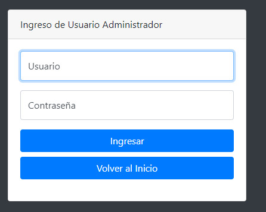

  
- **Panel de Administracion**:
En el Menu de seleccion se puede cambiar la  opcion para visualizar:
  1. Panel de Control Administrador
   
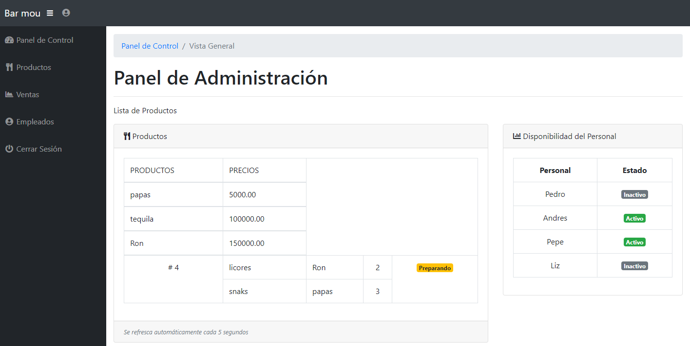

  2.Productos
   
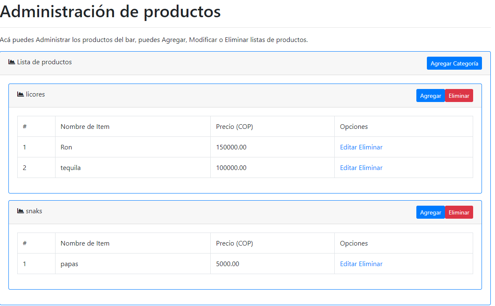

   3. Ventas
    
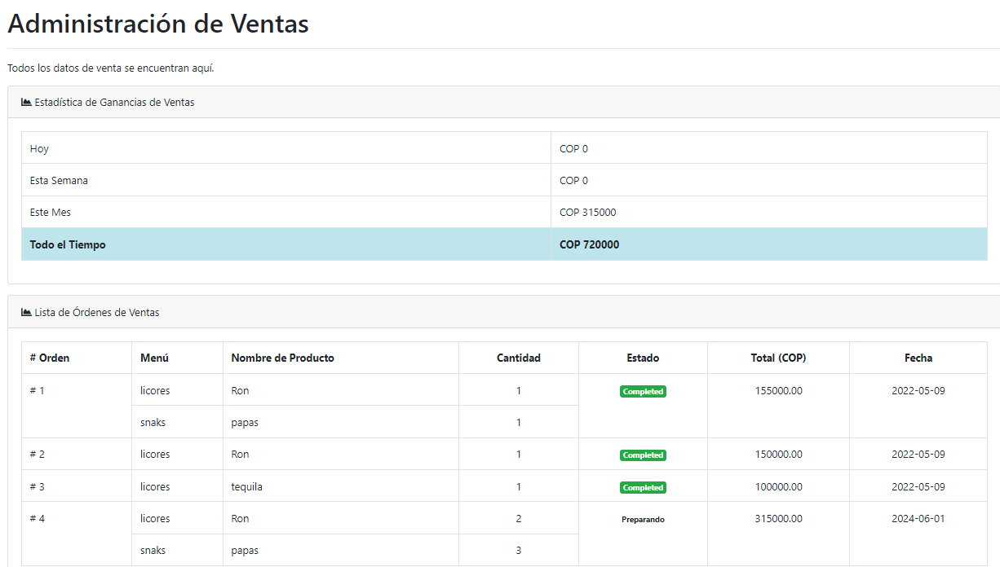

- Empleados
   
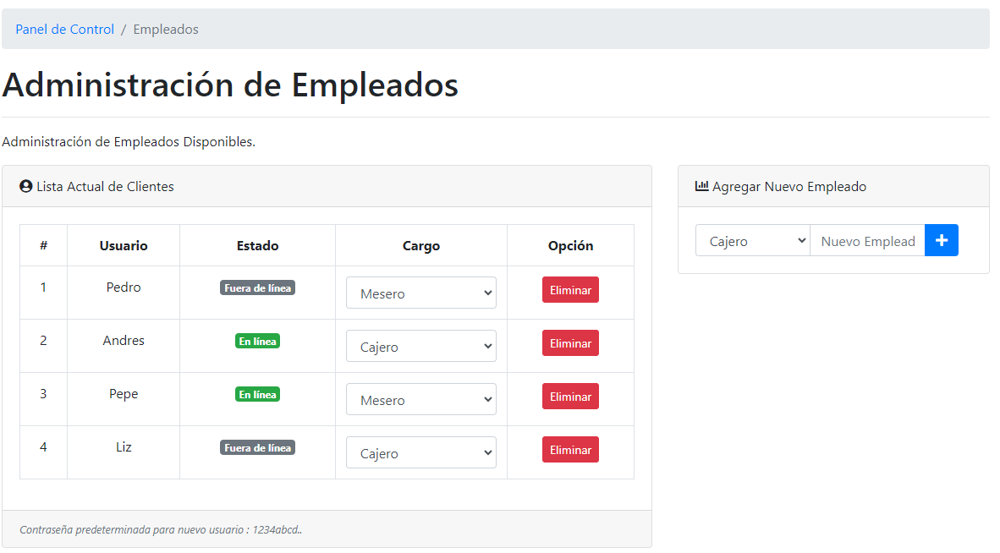

- **Interface de Logeo como empleado**:
Ingrese credenciales de Empleado
    
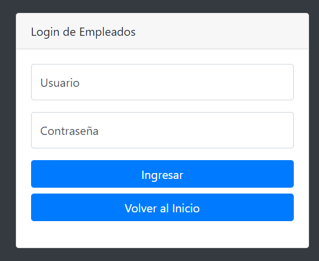

  - **Panel de Empleado Mesero**:
En el Menu de seleccion se puede cambiar la  opcion para visualizar:
  1. Panel de Empleado
   
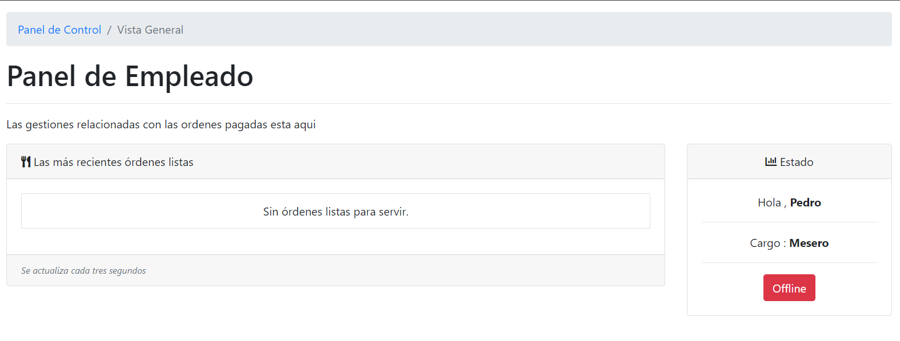

  2. Estado de conexion empleado Mesero 
  - Offline
   
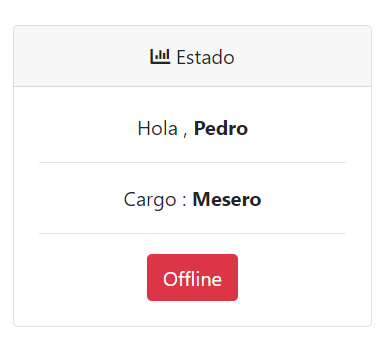

  - Online
   
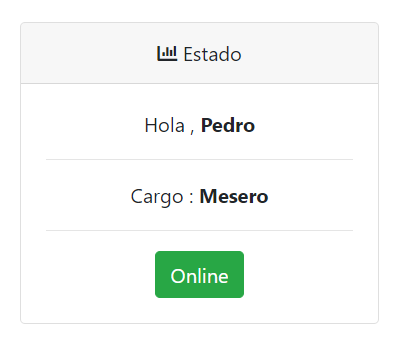

  3. Administracion de Ordenes 
   
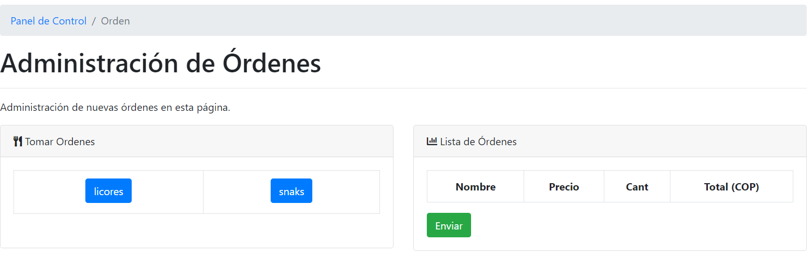

   - Tomar Orden por categoria
   
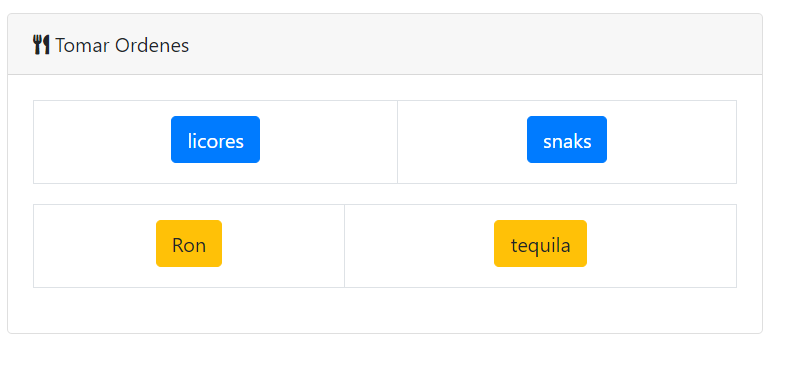

    - Seleccionar cantidad
    

     - Enviar resumen de pedido
    
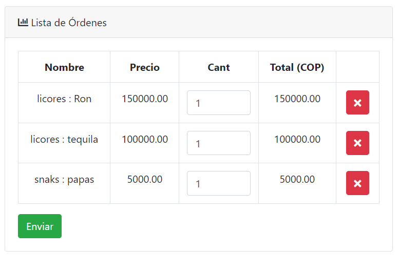

      
    - **Panel de Empleado Cajero**:
    - Enviar estado de la orden Preparando, Listo
    
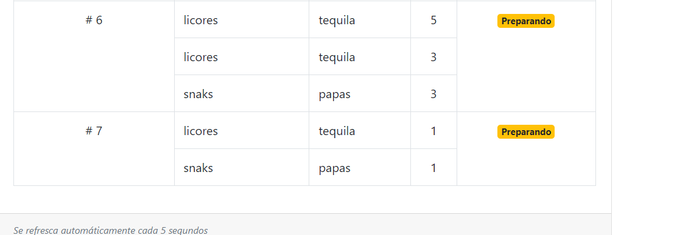

