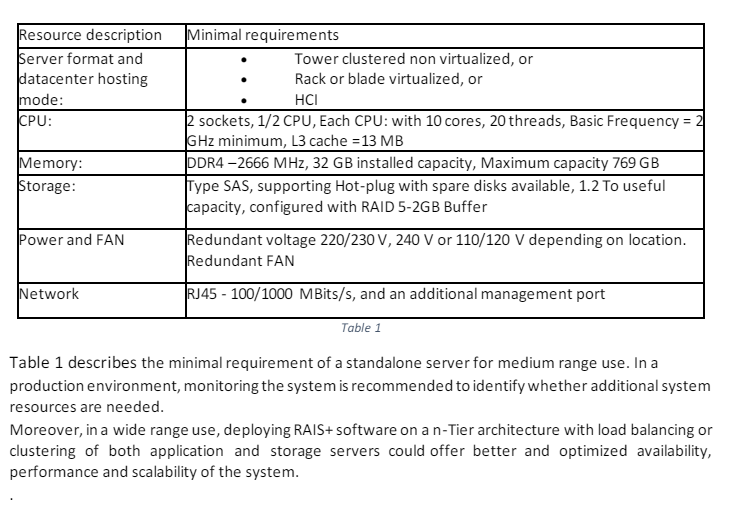
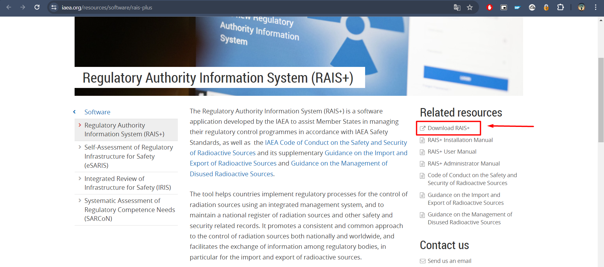
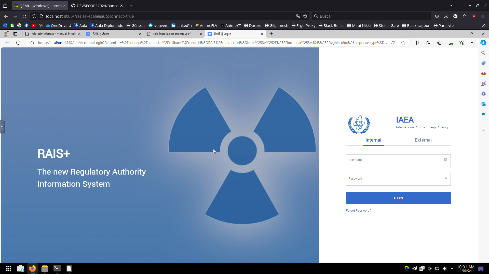
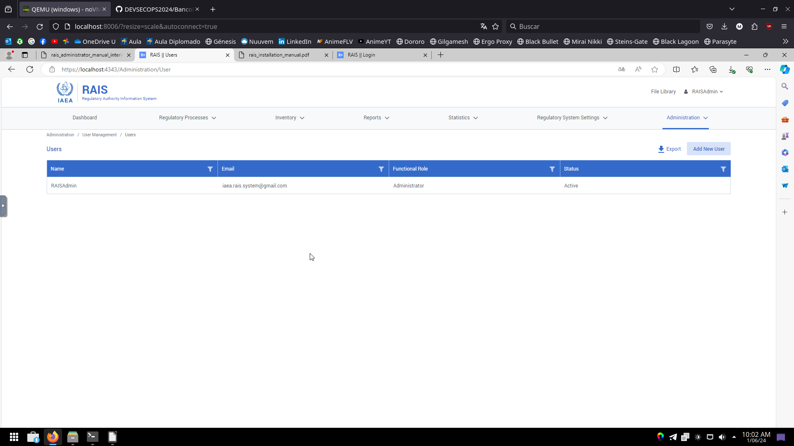

# <h1 align="center"> PROYECTO RAIS+ </h1>

Integrantes:
 - Juan Peña - ID: 635668
 - Oscar Yela - ID: 433321
 - Maycol Paez - ID: 751391
 - Brigitte Rodriguez - ID: 415800
 - Alvaro Adolfo Cote Sanchez - ID: 730352
 - Sebastián ....


## Intoducción
En el presente trabajo se pretende lograr la contenerización de RAIS+ la cual es una aplicacion desarrollada por la OIEA(Organismo Internacional de Energía Atómica), donde se busca llevar registro de fuentes de radiacion y controlar niveles de radiacion teniendo en cuenta las normativas internacionales establecidas por la OIEA así como con el Código de Conducta sobre la Seguridad Tecnológica y Física de las Fuentes Radiactivas del OIEA y las Directrices sobre la Importación y Exportación de Fuentes Radiactivas y Orientaciones sobre la Gestión de las Fuentes Radiactivas en Desuso que lo acompañan.
Esta aplicación promueve un enfoque coherente y común para el control de las fuentes de radiación a escala nacional e internacional y facilita el intercambio de información entre órganos reguladores, en particular relacionada con la importación y exportación de fuentes radiactivas personalizandose en funcion del Estado miembro. 


## Misión
Desplegar mediante contenedores la aplicación RAIS+ y siguiendo las directrices del OIEA, que facilite una gestión eficiente y estandarizada de las actividades y materiales radiactivos a nivel globalonales 


## Visión
La aplicación propuesta se desarrollará utilizando el Sistema Integrado de Información para la Regulación (RAIS+) en combinación con las directrices y estándares del Organismo Internacional de Energía Atómica (OIEA). Esta plataforma innovadora tiene como objetivo principal optimizar la gestión y el control de materiales y actividades radiactivas, garantizando un alto nivel de seguridad y cumplimiento regulatorio a nivel mundial.


## Objetivo
Contenerizar y gestionar el despliegue de la aplicación mediante docker en un servidor Windows.

# Requisitos del software de instalación de RAIS
## Requisitos de hardware
De acuerdo al manual de instalación de RAIS+, los requerimientos son los siguientes:

### Requisitos mínimos para un servidor standalone:
- RAIS+ standalone funcionará en cualquier ordenador moderno con sistema operativo Microsoft Windows. Los requisitos mínimos son los siguientes:
  - Disco duro (20 GB disponibles)
  - Memoria 4 GB (8 GB recomendados)
  - Procesador: Procesador x64, Velocidad: al menos 1,4 GHz

### Requisitos mínimos para un servidor informático: 


## Requisitos de software

- **Docker:** 
  - Ultima versión de Docker disponible junto con Docker Compose.
- **Sistema operativo:** 
  - Windows 2019 Server o posterior, con el último Service Pack y los parches instalados.
  - La versión más reciente de Internet Information Services.
  - **Nota:** 
- **Sistema de gestión de bases de datos:**
  - Microsoft SQL server 2019 o posterior
- **Otros módulos:** 
  - Hosting bundle 7.0.9
  - Target Framework asp.net core 6.0.

- **Descargue el software RAIS+ desde estas ubicaciones:**
  - https://www.iaea.org/resources/software/rais-plus
  - http://ns-files.iaea.org/files/RAIS_Software.zip

*Nota: El instalador de RAIS+ unicamente se puede descargar desde los links otorgados anteriormente.*


En la pagina de la IAEA se puede [descargar](https://www.iaea.org/resources/software/rais-plus) el instalador del programa RAIS+ junto con sus dependencias.



Igualmente dejamos los links de cada dependencia en caso que sea necesario descargarlos por separado:

 - dotnet-hosting-6.0.20 [Descargar](https://download.visualstudio.microsoft.com/download/pr/d7124775-38c9-460f-a269-7bc131b3dfbf/7f60bcc6030e408cf11a935d5451ffa4/dotnet-hosting-6.0.20-win.exe)
 - dotnet-hosting-7.0.9 [Descargar](https://download.visualstudio.microsoft.com/download/pr/a1918362-b09b-4593-a4b1-e5f0d9bd68b0/2470e7376871b57867655c057e878800/dotnet-hosting-7.0.9-win.exe) 
 - SQL2019-SSEI-Expr [Descargar](https://download.microsoft.com/download/7/f/8/7f8a9c43-8c8a-4f7c-9f92-83c18d96b681/SQL2019-SSEI-Expr.exe)
 - windowsdesktop-runtime-6.0.30 [Descargar](https://download.visualstudio.microsoft.com/download/pr/b14af665-ca5f-40a5-b0a9-4c7ca9ff1072/dfc3ab88e4dfbcece4fb7ee5246c406b/windowsdesktop-runtime-6.0.30-win-x64.exe)


# Ejecución en Docker

## Preparación
Para la ejecución en Docker se recomienda tener una carpeta con la siguiente estructura:

```
	├── proyecto
	│ ├── compose.yaml
	│ ├── install.bat
	│ ├── InstallDependecies.ps1
	│ ├── SetupIIS.ps1
	│ ├── IAEA_RAIS_Configuration_Tool.exe
	│ ├── Prerequisites/
	│ │ ├── dotnet-hosting-6.0.20-win.exe
	│ │ ├── dotnet-hosting-7.0.9-win.exe
	│ │ ├── SQL2019-SSEI-Expr.exe
	│ │ ├── windowsdesktop-runtime-6.0.30-win-x64.exe
```

### Archivo **install.bat**
Este archivo tiene la funcionalidad de ejecutar los scripts de powershell de manera automatica una vez termine la instalación de Windows en el contenedor.

```
::@echo off
:: Verificar si se está ejecutando con privilegios de administrador
net session >nul 2>&1
if %errorlevel% neq 0 (
  echo No tienes privilegios de administrador.
  echo Reiniciando con privilegios de administrador...
  powershell start-process "%~f0" -verb runas
  exit
)

echo Iniciando script...
powershell.exe -ExecutionPolicy Bypass -File C:\oem\SetupIIS.ps1
echo Instalación completada.


echo Iniciando script...
powershell.exe -ExecutionPolicy Bypass -File C:\oem\InstallDependecies.ps1
echo Instalación completada.

pause
```

### Archivo **InstallDependecies.ps1**

Este archivo es un script de PowerShell que se encargará de instalar todos los componentes del Internet Information Services (IIS) de manera automatica.

```
# This script installs IIS and the features required to
# run West Wind Web Connection.
#
# * Make sure you run this script from a Powershel Admin Prompt!
# * Make sure Powershell Execution Policy is bypassed to run these scripts:
# * YOU MAY HAVE TO RUN THIS COMMAND PRIOR TO RUNNING THIS SCRIPT!
Set-ExecutionPolicy Bypass -Scope Process

# To list all Windows Features: dism /online /Get-Features
# Get-WindowsOptionalFeature -Online 
# LIST All IIS FEATURES: 
# Get-WindowsOptionalFeature -Online | where FeatureName -like 'IIS-*'


Enable-WindowsOptionalFeature -Online -FeatureName IIS-WebServerRole
Enable-WindowsOptionalFeature -Online -FeatureName IIS-WebServer
Enable-WindowsOptionalFeature -Online -FeatureName IIS-CommonHttpFeatures
Enable-WindowsOptionalFeature -Online -FeatureName IIS-HttpErrors
Enable-WindowsOptionalFeature -Online -FeatureName IIS-HttpRedirect
Enable-WindowsOptionalFeature -Online -FeatureName IIS-ApplicationDevelopment

Enable-WindowsOptionalFeature -online -FeatureName NetFx4Extended-ASPNET45
Enable-WindowsOptionalFeature -Online -FeatureName IIS-NetFxExtensibility45

Enable-WindowsOptionalFeature -Online -FeatureName IIS-HealthAndDiagnostics
Enable-WindowsOptionalFeature -Online -FeatureName IIS-HttpLogging
Enable-WindowsOptionalFeature -Online -FeatureName IIS-LoggingLibraries
Enable-WindowsOptionalFeature -Online -FeatureName IIS-RequestMonitor
Enable-WindowsOptionalFeature -Online -FeatureName IIS-HttpTracing
Enable-WindowsOptionalFeature -Online -FeatureName IIS-Security
Enable-WindowsOptionalFeature -Online -FeatureName IIS-RequestFiltering
Enable-WindowsOptionalFeature -Online -FeatureName IIS-Performance
Enable-WindowsOptionalFeature -Online -FeatureName IIS-WebServerManagementTools
Enable-WindowsOptionalFeature -Online -FeatureName IIS-IIS6ManagementCompatibility
Enable-WindowsOptionalFeature -Online -FeatureName IIS-Metabase
Enable-WindowsOptionalFeature -Online -FeatureName IIS-ManagementConsole
Enable-WindowsOptionalFeature -Online -FeatureName IIS-BasicAuthentication
Enable-WindowsOptionalFeature -Online -FeatureName IIS-WindowsAuthentication
Enable-WindowsOptionalFeature -Online -FeatureName IIS-StaticContent
Enable-WindowsOptionalFeature -Online -FeatureName IIS-DefaultDocument
Enable-WindowsOptionalFeature -Online -FeatureName IIS-WebSockets
Enable-WindowsOptionalFeature -Online -FeatureName IIS-ApplicationInit
Enable-WindowsOptionalFeature -Online -FeatureName IIS-ISAPIExtensions
Enable-WindowsOptionalFeature -Online -FeatureName IIS-ISAPIFilter
Enable-WindowsOptionalFeature -Online -FeatureName IIS-HttpCompressionStatic

Enable-WindowsOptionalFeature -Online -FeatureName IIS-ASPNET45

Enable-WindowsOptionalFeature -Online -FeatureName IIS-DirectoryBrowsing
Enable-WindowsOptionalFeature -Online -FeatureName IIS-ServerSideIncludes
Enable-WindowsOptionalFeature -Online -FeatureName IIS-CustomLogging
Enable-WindowsOptionalFeature -Online -FeatureName IIS-CertProvider
Enable-WindowsOptionalFeature -Online -FeatureName IIS-DigestAuthentication
Enable-WindowsOptionalFeature -Online -FeatureName IIS-ClientCertificateMappingAuthentication
Enable-WindowsOptionalFeature -Online -FeatureName IIS-IISCertificateMappingAuthentication
Enable-WindowsOptionalFeature -Online -FeatureName IIS-URLAuthorization

Enable-WindowsOptionalFeature -Online -FeatureName MSMQ
Enable-WindowsOptionalFeature -Online -FeatureName MSMQ-Services
Enable-WindowsOptionalFeature -Online -FeatureName MSMQ-DCOMProxy
Enable-WindowsOptionalFeature -Online -FeatureName MSMQ-Server
Enable-WindowsOptionalFeature -Online -FeatureName MSMQ-ADIntegration

Enable-WindowsOptionalFeature -Online -FeatureName WAS-WindowsActivationService
Enable-WindowsOptionalFeature -Online -FeatureName WAS-ProcessModel
Enable-WindowsOptionalFeature -Online -FeatureName WAS-ConfigurationAPI

Enable-WindowsOptionalFeature -Online -FeatureName WCF-MSMQ-Activation45


# If you need classic ASP (not recommended)
#Enable-WindowsOptionalFeature -Online -FeatureName IIS-ASP


# The following optional components require 
# Chocolatey OR Web Platform Installer to install


# Install UrlRewrite Module for Extensionless Urls (optional)
###  & "C:\Program Files\Microsoft\Web Platform Installer\WebpiCmd-x64.exe" /install /Products:UrlRewrite2 /AcceptEULA /SuppressPostFinish
#choco install urlrewrite -y
    
# Install WebDeploy for Deploying to IIS (optional)
### & "C:\Program Files\Microsoft\Web Platform Installer\WebpiCmd-x64.exe" /install /Products:WDeployNoSMO /AcceptEULA /SuppressPostFinish
# choco install webdeploy -y

# Disable Loopback Check on a Server - to get around no local Logins on Windows Server
# New-ItemProperty HKLM:\System\CurrentControlSet\Control\Lsa -Name "DisableLoopbackCheck" -Value "1" -PropertyType dword
```

### Archivo **InstallDependecies.ps1**
Este archivo es un script de PowerShell que se encargará de instalar las dependencias (archivos ejecutables .exe) de manera automatica.

**NOTA: No incluye la instalación de SQL, ni tampoco del aplicativo RAIS+, estos deberán hacerse de manera manual**

```
# Define the path to the installer
$installerPath = "C:\oem\Prerequisites\dotnet-hosting-6.0.20-win.exe"

# Define any arguments needed for a silent or unattended installation
$installArguments = "/quiet /norestart"

# Check if the installer file exists
if (Test-Path $installerPath) {
    try {
        # Start the installation process
        Write-Output "Starting installation of: dotnet-hosting-6.0.20-win.exe"
        Start-Process -FilePath $installerPath -ArgumentList $installArguments -Wait -NoNewWindow
        Write-Output "Installation completed successfully."
    } catch {
        Write-Error "An error occurred during the installation: $_"
    }
} else {
    Write-Error "The installer file was not found at the specified path: $installerPath"
}


# Define the path to the installer
$installerPath = "C:\oem\Prerequisites\dotnet-hosting-7.0.9-win.exe"

# Define any arguments needed for a silent or unattended installation
$installArguments = "/quiet /norestart"

# Check if the installer file exists
if (Test-Path $installerPath) {
    try {
        # Start the installation process
        Write-Output "Starting installation of: dotnet-hosting-7.0.9-win.exe"
        Start-Process -FilePath $installerPath -ArgumentList $installArguments -Wait -NoNewWindow
        Write-Output "Installation completed successfully."
    } catch {
        Write-Error "An error occurred during the installation: $_"
    }
} else {
    Write-Error "The installer file was not found at the specified path: $installerPath"
}


# Define the path to the installer
$installerPath = "C:\oem\Prerequisites\windowsdesktop-runtime-6.0.30-win-x64.exe"

# Define any arguments needed for a silent or unattended installation
$installArguments = "/quiet /norestart"

# Check if the installer file exists
if (Test-Path $installerPath) {
    try {
        # Start the installation process
        Write-Output "Starting installation of: windowsdesktop-runtime-6.0.30-win-x64.exe"
        Start-Process -FilePath $installerPath -ArgumentList $installArguments -Wait -NoNewWindow
        Write-Output "Installation completed successfully."
    } catch {
        Write-Error "An error occurred during the installation: $_"
    }
} else {
    Write-Error "The installer file was not found at the specified path: $installerPath"
}
```

### Archivo **compose.yaml**
Este scrpit es para la descarga y cinfiguración de windows server 2022 en una imagen de docker lista para usar

```
services:
 windows:
  image: dockurr/windows
  container_name: windows
  enviroment:
   VERSION: "2022"
   LANGUAGE: "Spanish"
   RAM_SIZE: "2G"
   CPU_CORES: "4"
   DISK_SIZE: "40G"
  devices:
   - /dev/kvm
  cap_add:
   - NET_ADMIN
  ports:
   - 8006:8006
   - 3389:3389/tcp
   - 3389:3389/udp
  stop_grace_period: 2m
  volumes:
   - C:\Users\...\Recursos:\oem
   - C:\Users\...\Recursos:\shared
 ```

el puerto ```6006``` es el usado para que ingrese al navegador local, ```VERSION: "2022"``` es la version de windows que se quiere instalar, en este caso windows server 2022.

Asi se muetra el programa cuando ya termino la instalacion, al ejecutarse ingresa a la pagina de inicio de sesion:



Asi se muestra el perfil de la cuenta de administrador:


