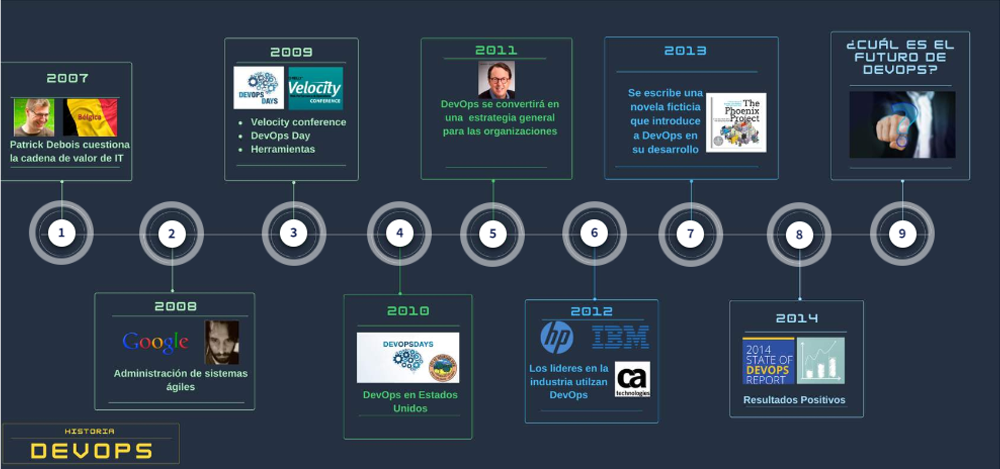
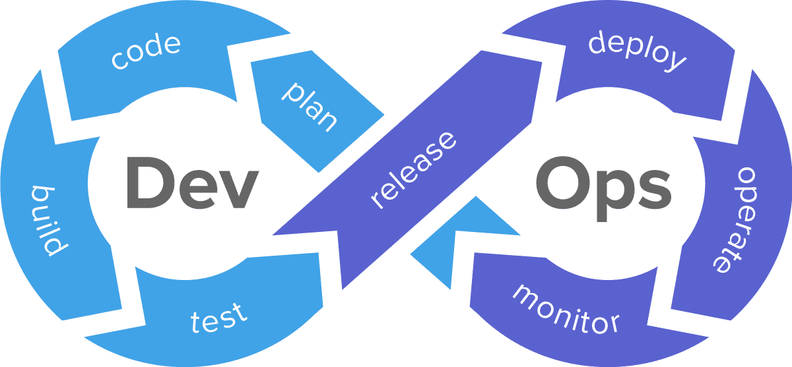
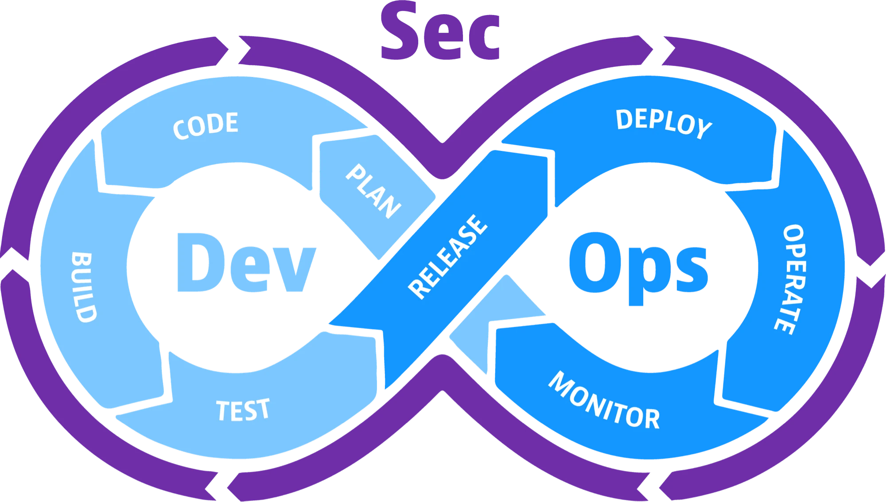

# <h1 align="center"> DEVSECOPS </h1>

Integrantes:
 - Juan Peña - ID: 635668
 - Oscar Yela - ID: 433321
 - Maycol Paez - ID: 751391
 - Integrante 4 - ID: 000000
 - Integrante 5 - ID: 000000

## Introducción

DevSecOps es una metodología que integra la seguridad desde el principio en el ciclo de vida del desarrollo de software, en el marco de las prácticas de DevOps. Esta filosofía busca romper las barreras tradicionales entre los equipos de desarrollo, operaciones y seguridad, promoviendo la colaboración y la responsabilidad compartida en todas las etapas del proceso de desarrollo y despliegue de aplicaciones.

En lugar de tratar la seguridad como un aspecto separado o una tarea posterior, DevSecOps fomenta la automatización de las pruebas de seguridad, la implementación de controles de seguridad continuos y la integración de herramientas de seguridad en todo el ciclo de vida de desarrollo, desde la planificación y el diseño hasta el despliegue y la monitorización en producción. El objetivo es mejorar la seguridad de las aplicaciones y sistemas, sin sacrificar la velocidad ni la agilidad del desarrollo, permitiendo la entrega de software de forma rápida y segura.

DevSecOps

## ¿Qué es DevSecOps?

### La historia de DevOps

 - [ ] **2007:** La historia comienza con **Patrick Debois**, quien estaba inquieto debido a su constante cambio entre entre el desarrollo ágil y constantes imprevistos de los grupos de operaciones, por lo que se planteo que debia existir una mejor manera de que los mundos de desarrollo y operaciones no estuvieran tan distanciados ni con tantos conflictos.
 - [ ] **2008:** En la conferencia Ágil de Toronto, **Andrew Schafer** publico una oferta para moderar una reunión llamada "Birds of Feather", para discutir el tema de "Infraestrutura ágil". Solo una persona se presento, Patrick Debois. Sus discusiones y el intercambio de ideas con otros hicieron avanzar el concepto de "administración de sistemas ágiles".
 - [ ] **2009:** En la **O'Reilly Velocity Conference**, dos empleados de Flickr dieron una presentación titulada "Mas de 10 implementaciones por día". El objetivo principal era enfocarse en asegurar en que Dev y Ops trabajaran juntos y de forma fluida a través de las herramientas y procesos ágiles. Incapaz de asistir en persona, **Debois**, vio la presentación por transimisión en video. Se inspiro y a instancias de otros através de las redes sociales, formó sus propia conferencia llamada **DevopsDays** en Gante, Bélgica. En este momento el termino **DevOps** habia aterrizado en los libros de historia.
 - [ ] **2010:** Con una comunidad creciente, una conferencia **DevopsDays** se lleva a cabo por primera vez en los Estados Unidos, inmediatamente después de la conferencia anual Velocity. En este punto hay mas de 30 conferencias de DevopsDays ya programadas para 2018, incluidas docenas en los Estados Unidos.
 - [ ] **2011:** El mensaje es claro, DevOps llegará muy pronto a las empresas. **"Para 2015, DevOps evolucionara de una estrategia de nicho empleada por grandes proveedores de nube a un estrategia general empleada por el 20% de las organizaciones de Global 2000".** Afirma Cameron Haight (Marzo 18 del 2011).
 - [ ] **2012:** Los proveedores de software líderes en la industria como: IBM, HP y CA Technologies aumentan su presencia en el mercado con herramientas DevOps de clase empresarial.
 - [ ] **2013:** Otro momento digno de mencion en la historia de DevOps fue la publicación del libro **"The Phoenix Project"**, escrito por Gene Kim, Kevin Behr y George Spafford. Esta novela ficticia cuenta la historia de un gerente de TI que se ve empujado a una situación aparentemente desesperada, ya que está encargado de rescatar un proyecto de desarrollo de comercio electronico de misión critica. Su misterioso mentor, un miembro de la junta empapado en las disciplinas de la manufactura a gran escala, guía al personaje principal hacia nuevas formas de pensar sobre TI y desarrollo de aplicaciones, introduciendo el concepto de DevOps en el camino.

### Definición de DevOps

- **Equipo Dev (Desarrollo)**
	Son las personas que se encargan tanto de construir y entregar software, como también las que garantizan la calidad del producto. 
	También lo conforman las personas de análisis y planificación de los requerimientos. La prioridad de este equipo es entregar un producto con calidad, cumpliendo con las necesidades del negocio.
	
 - **Equipo Ops (Operaciones)**
	Son las personas que realizan el despliegue del producto construido en diferentes entornos. 
	Se encargan de aprovisionar toda la infraestructura necesaria para que la aplicación se ejecute correctamente, y posteriormente de monitorear el rendimiento, el tiempo de actividad, el uso de CPU y registrar errores, entre otros.
	El objetivo principal de este equipo es garantizar la estabilidad, seguridad, confiabilidad y disponibilidad de las soluciones en ambientes productivos.
	
 - **DevOps**
	DevOps es un movimiento que llega para eliminar esas barreras invisibles, eliminar silos de trabajo aislados, automatizar muchos procesos manuales, y generar transformación ténica y cultural dentro de los equipos Dev y Ops. Logrando además, que estos se pueda ver reflejado en retorno de inversión para la compañía.
	El objetivo principal de DevOps es que se cumplan los objetivos Dev y Ops. 
	"Hacer más rapido el ciclo de vida del software con entrega continua"

 
 > DevOps consiste en eliminar las barreras entre dos equipos que anteriormente estaban aislados, el de desarrollo y el de operaciones.
 
 
### Definición de DevSecOps.
> "DevSecOps incluye seguridad en las prácticas de DevOps al incorporar la seguridad en las aplicaciones de manera temprana y continua a través de un ciclo de vida de desarrollo de software (SDLC) rápido, iterativo y automatizado. El objetivo principal es producir código más seguro y más rápidamente. DevSecOps no pretende convertir a los desarrolladores en expertos en seguridad, sino educarlos en las mejores prácticas que promueven procesos de desarrollo más seguros."  Novakovic & Jenkins (2022)

## Importancia de DevSecOps

 - ¿Por qué es importante integrar seguridad en DevOps?
	 - DevSecOps, es importante puesto que combina un importante nivel de seguridad con ciclos cortos de lanzamientos de produccion. tambien posee ciclos de desarrollo más cortos los cuales favorecen la innovacion.
   Ademas de esto al producirse la unión entre dos equipos aumenta la productividad haciendo que el proceso sea mas fluido ya que todo esta orientado a un objetivo común. Reduciendo los errores de implementación, y mejorando la gestion de los recursos incrementando la eficiencia y reduciendo los tiempos de desarrollo y errores o problemas de código. Ademas en el caso de que se deba dar solución a cualquier problema, la recuperación será más rápida, gracias al conocimiento e involucración de todos los miembros durante el proceso de desarrollo.
- Beneficios para las organizaciones
	- DevSecOps beneficia a las organizaciones de forma tal como:
 		- Detecte las vulnerabilidades del software en una fase temprana en lugar de esperar a que el software esté terminado, realizan comprobaciones en cada fase. Los equipos de software tienen la capacidad de detectar los problemas de seguridad en fases más tempranas y de reducir el costo y el tiempo necesarios para solucionar las vulnerabilidades.
		- Gracias a DevSecOps, los equipos de software pueden automatizar las pruebas de seguridad y reducir los errores humanos. También evita que la evaluación de la seguridad se convierta en un cuello de botella dentro del proceso de desarrollo.
 		- Los equipos de software utilizan DevSecOps para cumplir con los requisitos normativos mediante la adopción de prácticas y tecnologías de seguridad profesionales. Identifican los requisitos de protección y seguridad de los datos en el sistema.
		- Los equipos de software son más conscientes de las prácticas recomendadas de seguridad al desarrollar una aplicación. Son más proactivos a la hora de detectar posibles problemas de seguridad en el código, los módulos u otras tecnologías para crear la aplicación.
		- DevSecOps fomenta la colaboración flexible entre los equipos de desarrollo, operaciones y seguridad. Comparten la misma comprensión de la seguridad del software y utilizan herramientas comunes para automatizar las evaluaciones y los informes. Todos se centran en las formas de aportar más valor a los clientes sin poner en riesgo la seguridad. 	 
    - Seguridad de las aplicaciones
     	- La seguridad en DevOps se refiere a la implementación de prácticas y herramientas para garantizar la seguridad del software en todas las etapas del ciclo de vida del desarrollo de software, desde la planificación hasta la entrega y el mantenimiento. El objetivo es garantizar que el software sea seguro y esté protegido contra las amenazas de seguridad, incluyendo la identificación temprana y la resolución de vulnerabilidades de seguridad en el software, la protección de datos y la prevención de posibles ataques. 
       	- Existen diferentes tipos de pruebas de seguridad de las aplicaciones, como las pruebas dinámicas de seguridad de las aplicaciones (DAST), las pruebas estáticas de seguridad de las aplicaciones (SAST), las pruebas interactivas de seguridad de las aplicaciones (IAST) y la autoprotección de las aplicaciones en tiempo de ejecución (RASP). Cada una se incorpora en una fase diferente del desarrollo para identificar vulnerabilidades de seguridad en el entorno, identificar vulnerabilidades en el código, supervisar el rendimiento de la aplicación y recopilar datos para detectar y resolver problemas de seguridad a medida que surgen.
    - Deteccion temprana de vulnerabilidades
    	- Las pruebas continuas permiten que los entornos DevSecOps identifiquen problemas dentro de su infraestructura mucho más rápidamente, lo que reduce la posibilidad de una infracción, pérdida de trabajo o retrasos dentro del proceso, especialmente con prácticas como las pruebas de penetración.	 
    - cumplimiento y gobernanza mejoradas
    	- Existen menos riesgos de cumplimiento relacionados con la implementación y el lanzamiento de la aplicación, ya que se implementan controles de seguridad en cada parte del desarrollo, lo que reduce el riesgo de una infracción.
 - Impacto en la entrega de software.

## Los pilares de DevSecOps

-  Automatización: Con DevSecOps se consigue CI y CD, es decir, Integración y Entrega Continua, lo que permite mejorar la calidad y la velocidad del desarrollo de software detectando errores más rápidos y automatizar todo el proceso desde la confirmación del código hasta la puesta en producción.
-  Colaboración.
-  Integración continua.
-  Entrega continua.
-  Monitoreo y retroalimentación.

## Principales prácticas y herramientas

-  Seguridad desde el diseño.
-  Pruebas de seguridad automatizadas.
-  Escaneo de vulnerabilidades.
-  Monitoreo de seguridad en tiempo real.
-  Gestión de identidades y accesos.
-  Herramientas populares en el ecosistema DevSecOps.
	- **invicti**
 		Es una herramienta que se puede implementar en clclo de vida de desarrollo para realizar gestiones de seguridad, su analisis es exhaustivo aportando prescion en la deteccion de problemas de forma automatizada mostrando rapidamente los problemas para solucionarlos.

## Casos de estudio

-  Ejemplos de empresas que han adoptado DevSecOps con éxito.
-  Lecciones aprendidas y resultados obtenidos.

## Conclusiones

-  Recapitulación de los puntos clave.
-  Perspectivas futuras de DevSecOps.
-  Recursos adicionales para seguir aprendiendo

## Referencias
- Novakovic, K., & Jenkins, C. (2022, 27 enero). DevSecOps: Why you should care and how to get started | Red Hat Developer. Red Hat Developer. https://developers.redhat.com/articles/2022/01/27/devsecops-why-you-should-care-and-how-get-started
- Felipe Redondo, A. M., & Núñez Cárdenas, F. de J. (2022). DevOps: un vistazo rápido. _Ciencia Huasteca Boletín Científico De La Escuela Superior De Huejutla_, _10_(19), 35-40. https://doi.org/10.29057/esh.v10i19.8121
- Chakray. (2023, 13 diciembre). ¿Qué es DevOps y por qué es tan importante? Chakray. https://www.chakray.com/es/devops-que-es-y-por-que-es-tan-importante/
- evolución e importancia de la seguridad para DevOps y DevSecOps. (2024, 9 febrero). GlobalSign. https://www.globalsign.com/es/blog/devops-vs-devsecops-evolucion-e-importancia-de-la-seguridad#:~:text=Al%20integrar%20la%20seguridad%20de,los%20procesos%20de%20desarrollo%20optimizados.
- ¿Qué es DevSecOps? - Explicación de las operaciones de seguridad para desarrolladores - AWS. (s. f.). Amazon Web Services, Inc. https://aws.amazon.com/es/what-is/devsecops/
- Sentrio. (2023, 10 mayo). Seguridad en DevOps: prácticas y herramientas para garantizar la seguridad. Sentrio. https://sentrio.io/blog/seguridad-en-devops-practicas-y-herramientas-para-garantizar-la-seguridad/#:~:text=%C2%BFQu%C3%A9%20es%20la%20Seguridad%20en,la%20entrega%20y%20el%20mantenimiento.
