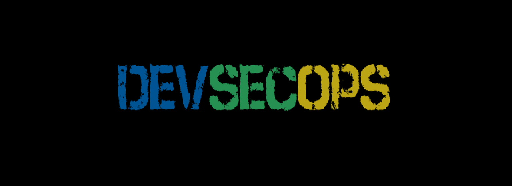

  <h1 align="center" style="color: #eee;">
    :closed_lock_with_key: LA SEGURIDAD EN EL PROCESO DEVOPS :closed_lock_with_key:
     
     
    
  </h1>

<!--Tabla de contenido de los temas de DevSecOps-->

# TABLA DE CONTENIDO
- [Introducción](#Introducción)
- [Seguridad en la infraestructura como código (IaC)](#Seguridad-en-la-infraestructura-como-código-(IaC))
- [Gestión de identidades y accesos](#Gestión-de-identidades-y-accesos)
- [Seguridad en contenedores y orquestación de contenedores](#Seguridad-contenedores)
- [Gestión de incidentes de seguridad](#Gestión-incidentes)
- [Educación y concienciación en seguridad](#Educación-concienciación)
- [Protección de la cadena de suministro de software](#Protección-cadena)
- [Autores](#autores)

---
## Introducción
Contenido

## Seguridad en la infraestructura como código (IaC)
Contenido

## Gestión de identidades y accesos
Contenido

## Seguridad en contenedores y orquestación de contenedores
Contenido

## gestion de incidentes de seguridad
Contenido

## Educación y concienciación en seguridad
Contenido

## Protección de la cadena de suministro de software
Contenido

## Autores
Contenido
