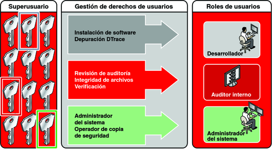
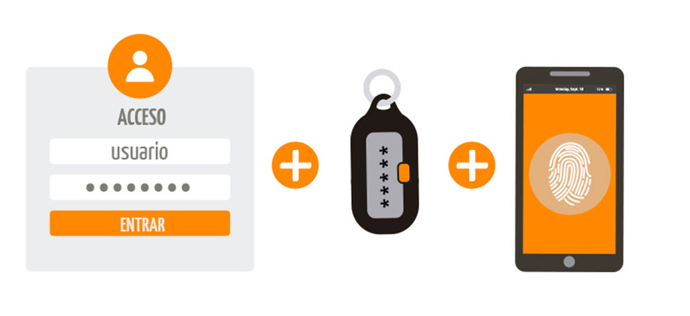
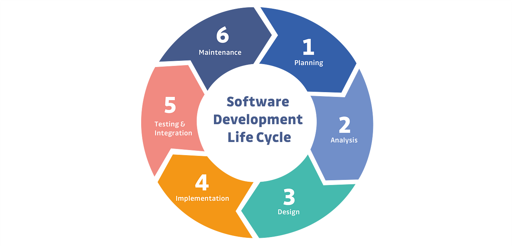

  <h1 align="center" style="color: #eee;">
    :closed_lock_with_key: LA SEGURIDAD EN EL PROCESO DEVOPS :closed_lock_with_key:
     
     
    
  </h1>

<!--Tabla de contenido de los temas de DevSecOps-->

# TABLA DE CONTENIDO
- [Introducción](#introducción)
- [Seguridad en la infraestructura como código (IaC)](#seguridad-en-la-infraestructura-como-código-iac)
- [Gestión de Identidades y Accesos (IAM)](#gestión-de-identidades-y-accesos-iam)
- [Seguridad en contenedores y orquestación de contenedores](#seguridad-en-contenedores-y-orquestación-de-contenedores)
- [Gestión de incidentes de seguridad](#seguridad-en-ontenedores-y-orquestación-de-contenedores)
- [Educación y concienciación en seguridad](#educación-y-concienciación-en-seguridad)
- [Protección de la cadena de suministro de software](#seguridad-en-contenedores-y-orquestación-de-contenedores)
- [Glosario](#glosario)
- [Autores](#autores)

---
## Introducción
Contenido

## Seguridad en la infraestructura como código (IaC)
Contenido

## Gestión de Identidades y Accesos (IAM)

La Gestión de Identidades y Accesos (IAM) desempeña un papel crucial en entornos DevOps para garantizar la seguridad de los sistemas y datos. En este documento, exploraremos la implementación de controles de acceso basados en roles (RBAC), autenticación multifactor (MFA) y auditoría de acceso como prácticas fundamentales en la seguridad de los entornos DevOps.

## Implementación de Controles de Acceso Basados en Roles (RBAC)

Los controles de acceso basados en roles (RBAC) son una forma efectiva de gestionar quién tiene acceso a qué recursos dentro de un entorno DevOps. En RBAC, los usuarios se asignan roles específicos que determinan sus permisos y acciones permitidas. Algunas mejores prácticas para la implementación de RBAC incluyen:

- **Asignación de roles según responsabilidades**: Identificar y asignar roles específicos según las responsabilidades y funciones de los usuarios en el equipo DevOps.
- **Principio de privilegios mínimos**: Conceder a los usuarios solo los permisos necesarios para realizar sus tareas asignadas, reduciendo así la superficie de ataque potencial.
- **Revisión periódica de permisos**: Realizar revisiones regulares de los permisos asignados para garantizar que estén alineados con las necesidades operativas actuales y para eliminar cualquier acceso no utilizado o innecesario.

## Autenticación Multifactor (MFA)

La autenticación multifactor (MFA) agrega una capa adicional de seguridad al requerir múltiples formas de autenticación antes de permitir el acceso a los sistemas o datos. Algunas prácticas clave para implementar MFA en entornos DevOps incluyen:

- **Uso de factores múltiples**: Utilizar al menos dos factores de autenticación, como contraseñas, tokens de autenticación, huellas dactilares o reconocimiento facial.
- **Integración con sistemas de autenticación centralizados**: Implementar soluciones de MFA que se integren fácilmente con sistemas de autenticación centralizados, como LDAP o Active Directory, para una administración centralizada de identidades.
- **Promoción de MFA en todas las interacciones**: Fomentar el uso de MFA en todas las interacciones, incluido el acceso a la consola de administración, herramientas de desarrollo y sistemas de control de versiones.

## Auditoría de Acceso

La auditoría de acceso es crucial para monitorear y registrar las actividades de los usuarios dentro del entorno DevOps, lo que ayuda a identificar y mitigar posibles amenazas de seguridad. Algunas estrategias para la auditoría de acceso efectiva incluyen:

- **Registro exhaustivo de actividades**: Registrar todas las acciones realizadas por los usuarios, incluidos los intentos de inicio de sesión, cambios de configuración y accesos a recursos sensibles.
- **Análisis de registros automatizado**: Implementar herramientas de análisis de registros automatizado para detectar patrones de comportamiento sospechosos o actividades anómalas.
- **Retención de registros a largo plazo**: Mantener registros de auditoría durante períodos prolongados para cumplir con los requisitos de cumplimiento y facilitar la investigación de incidentes de seguridad.

En conclusión, la implementación efectiva de controles de acceso basados en roles, autenticación multifactor y auditoría de acceso son elementos esenciales para garantizar la seguridad de los sistemas y datos en entornos DevOps. Al seguir estas prácticas, las organizaciones pueden fortalecer su postura de seguridad y mitigar los riesgos asociados con el desarrollo y la implementación ágil de software.

## Seguridad en contenedores y orquestación de contenedores
Contenido

## Gestión de incidentes de seguridad

En la seguridad de DevOps, la gestión de incidentes implica establecer procesos y procedimientos para detectar, responder y recuperarse de eventos de seguridad. Esto requiere una estrecha coordinación entre equipos de desarrollo, operaciones y seguridad para garantizar una respuesta efectiva ante cualquier incidente que pueda surgir en entornos DevOps.

**@Proceso** :technologist: Gestión de incidentes de DevOps :computer:

1. **Detección:**
   + Utilizar herramientas de monitoreo para detectar actividades sospechosas en tiempo real.

2. **Notificación:**
   + Establecer canales como Slack o Microsoft Teams para notificar sobre incidentes.

3. **Investigación:**
   + Analizar registros e inspecciona sistemas para comprender la naturaleza del incidente.

4. **Respuesta:**
   + Actúar rápidamente con medidas como aplicar parches o desactivar servicios comprometidos.

5. **Recuperación:**
   + Automatizar la restauración de sistemas a un estado operativo normal, usando herramientas como Jenkins.

6. **Análisis Post-Mortem:**
   + Identifica lecciones aprendidas y oportunidades de mejora en los procesos de seguridad.

7. **Coordinación Interdepartamental:**
   + Facilita la colaboración entre equipos de desarrollo, operaciones y seguridad para una respuesta coordinada.

     
  

La seguridad desempeña un papel fundamental en el proceso de DevOps. Integrar prácticas y herramientas de seguridad en estos procesos es crucial para asegurar la protección de sistemas y aplicaciones contra posibles amenazas y vulnerabilidades. Cada equipo debe evaluar sus necesidades y requisitos específicos antes de seleccionar las herramientas adecuadas y adoptar las prácticas de seguridad pertinentes. Esta medida garantiza tanto la entrega de software como la protección de usuarios y organizaciones contra posibles vulnerabilidades.

## Educación y concienciación en seguridad

La educación y concienciación en seguridad juegan un papel crucial en el proceso de DevOps. Más allá de implementar herramientas y prácticas técnicas, es fundamental cultivar una comprensión profunda de la importancia de la seguridad en cada fase del ciclo de vida del desarrollo de software. Desde el diseño hasta la implementación, la educación y concienciación en seguridad son pilares clave para proteger los sistemas y datos contra las crecientes amenazas. 

**@Integrar** :writing_hand: educación y concienciación en seguridad DevOps :ear_with_hearing_aid:

            1. Capacitación Continua
            2. Integración Temprana de la Seguridad
            3. Automatización de Pruebas
            4. Desarrollo de Casos de Uso Prácticos
            5. Fomento de la Comunicación y Colaboración
            6. Revisiones Periódicas y Mejora Continua

Integrar efectivamente la educación y concienciación en seguridad en los procesos de DevOps es fundamental para promover una cultura de seguridad sólida y mitigar los riesgos en cada etapa del ciclo de vida del desarrollo de software.

**@Mejores Prácticas** :white_check_mark:

                                    Mejores Prácticas para Promover una Cultura de Seguridad Sólida en Todo el Equipo
                                               |
                           _________________|___________________
                          |                 |                   |
          Involucramiento de    Capacitación Continua    Integración de Seguridad  
            la Alta Dirección      en Seguridad             en Procesos
                   |                    /    \                     /     \
                   |         Comunicación  Pruebas y      Actualizaciones  Evaluación y 
                   |           Abierta     Evaluaciones   y Parches       Mejora Continua
                   |            /                                                |
                   |   Reconocimiento                                     Resiliencia y 
                   |   y Recompensas                             Planificación de Contingencia
                   |___________________|_________________________________________|____________

## Protección de la cadena de suministro de software

En este tipo de seguridad se combinan las practicas recomendadas de la gestión de los **riesgos** y la **ciberseguridad** para proteger esta cadena en los puntos más vulnerables. La cadena de suministro de software consta de todo el código, las personas, los sistemas y los procesos que contribuyen al desarrollo y la entrega de tu software, es decir, está directamente relacionado con el código durante el [ciclo de vida de desarrollo del software (SDLC)](#ciclo-de-vida-de-desarrollo-del-software-sdlc).

### Riesgos de seguridad de la cadena de suministro del software

| Riesgos | Definición |
| --- | ----------- |
| Puntos Vulnerables | Son fallas en el código del software que pueden aprovecharse para la filtración de datos. |
| Licencias | Es un riesgo legal que podría obligar al propietario convertir cualquier elemento del software en open source y anular los derechos de patente |
| Dependencias de terceros | Analice todo el código de terceros y comuníquese con sus proveedores para conocer las practicas de seguridad que se usan. |
| Procesos y políticas | Cree políticas para los desarrolladores y los procesos que le permitan responder ante un punto vulnerable |

### Reducción de las amenazas a la cadena de suministro de software

#### Para equipos de seguridad

- [x] Ofrecer el acceso con privilegios mínimos a los recursos.
- [x] Realizar capacitaciones de seguridad al personal
- [x] Reforzar la seguridad en todos los dispositivos conectados.
- [x] Conocer los proveedores y entidades con quienes se hacen negocios.
- [x] Analizar lo sistemas expuestos y ejecutar parches de seguridad.

#### Para desarrolladores

- [x] Validar las sumas de comprobación.
- [x] Incluir las dependencias de los proveedores en el control de versiones.
- [x] Publicar y usar la lista de elementos de software.
- [x] Firmar los elementos del software de manera digitar para autenticar su procedencia.
- [x] Aprovechar la automatización para los procesos y políticas.
- [x] Examinar el sistema con herramientas automatizadas de pruebas de seguridad.

## Glosario

### Ciclo de vida de desarrollo del software (SDLC)

 Es un marco que se utiliza para desarrollar, implementar y mantener el software, algunas de las etapas del SDLC son:

- Planificacion
- Análisis de requisitos
- Diseño
- Desarrollo
- Documentación
- Pruebas
- Implementación
- Mantenimiento

## Autores
Contenido
