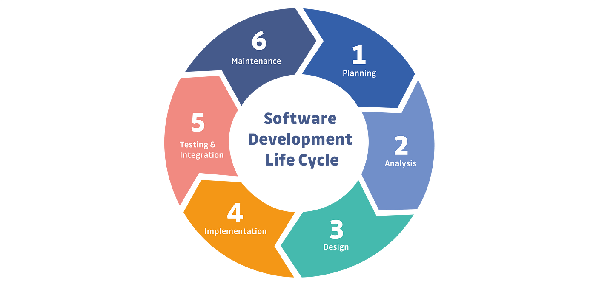

# Que es DevSecOps?

## Contenido

- [Seguridad de la cadena de suministro de software](https://github.com/jaiderospina/DEVSECOPS2024/edit/main/TAREA_1/Grupo_3/grupo_3.md#tituloCadenaSuministros)
    - [Riesgos de seguridad de la cadena de suministro del software](#riesgosCadenaSuministros)
    - [Riesgos de seguridad de la cadena de suministro del software](#reduccionCadenaSuministros)
- [Glosario](#glosario)

## Seguridad de la cadena de suministro de software {#tituloCadenaSuministros}

En este tipo de seguridad se combinan las practicas recomendadas de la gestión de los **riesgos** y la **ciberseguridad** para proteger esta cadena en los puntos más vulnerables. La cadena de suministro de software consta de todo el código, las personas, los sistemas y los procesos que contribuyen al desarrollo y la entrega de tu software, es decir, está directamente relacionado con el código durante el [ciclo de vida de desarrollo del software (SDLC)](#tituloSDLC).

### Riesgos de seguridad de la cadena de suministro del software {#riesgosCadenaSuministros}

| Riesgos | Definición |
| --- | ----------- |
| Puntos Vulnerables | Son fallas en el código del software que pueden aprovecharse para la filtración de datos. |
| Licencias | Es un riesgo legal que podría obligar al propietario convertir cualquier elemento del software en open source y anular los derechos de patente |
| Dependencias de terceros | Analice todo el código de terceros y comuníquese con sus proveedores para conocer las practicas de seguridad que se usan. |
| Procesos y políticas | Cree políticas para los desarrolladores y los procesos que le permitan responder ante un punto vulnerable |

### Reducción de las amenazas a la cadena de suministro de software {#reduccionCadenaSuministros}

#### Para equipos de seguridad

- [x] Ofrecer el acceso con privilegios mínimos a los recursos.
- [x] Realizar capacitaciones de seguridad al personal
- [x] Reforzar la seguridad en todos los dispositivos conectados.
- [x] Conocer los proveedores y entidades con quienes se hacen negocios.
- [x] Analizar lo sistemas expuestos y ejecutar parches de seguridad.

#### Para desarrolladores

- [x] Validar las sumas de comprobación.
- [x] Incluir las dependencias de los proveedores en el control de versiones.
- [x] Publicar y usar la lista de elementos de software.
- [x] Firmar los elementos del software de manera digitar para autenticar su procedencia.
- [x] Aprovechar la automatización para los procesos y políticas.
- [x] Examinar el sistema con herramientas automatizadas de pruebas de seguridad.

## Glosario {#glosario}

### Ciclo de vida de desarrollo del software (SDLC) {#tituloSDLC}

 Es un marco que se utiliza para desarrollar, implementar y mantener el software, algunas de las etapas del SDLC son:

- Planificacion
- Análisis de requisitos
- Diseño
- Desarrollo
- Documentación
- Pruebas
- Implementación
- Mantenimiento
