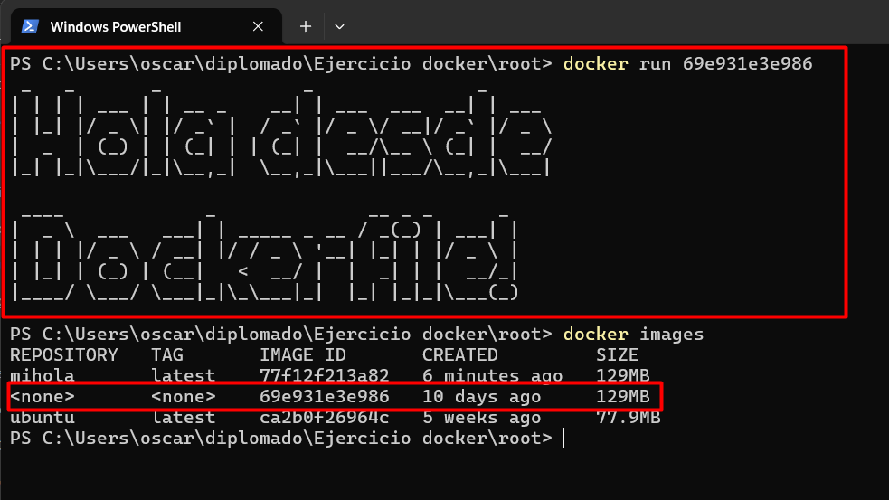
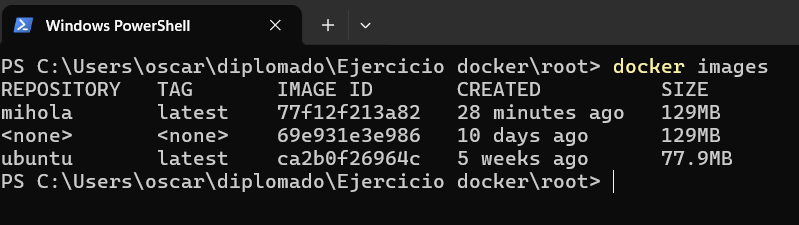
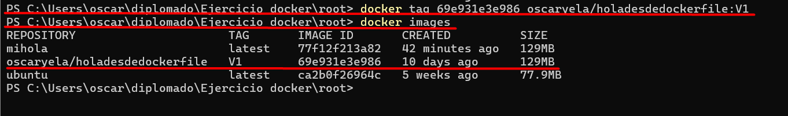
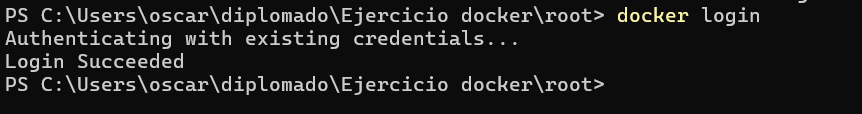
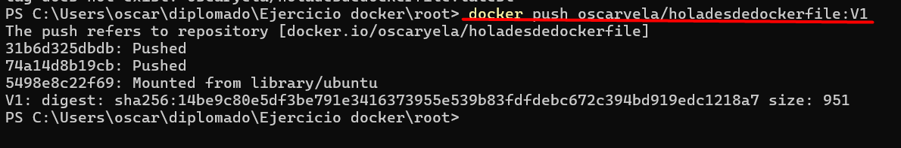
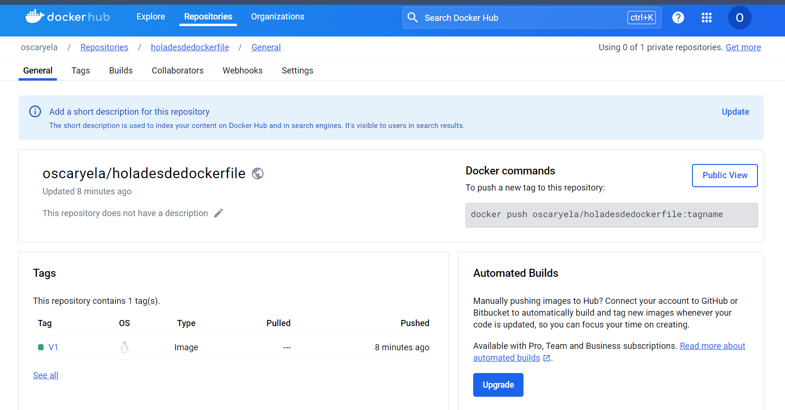

# <h1 align="center"> SUBIR IMAGENES A DOCKERHUB </h1>

Integrantes:
 - Juan Peña - ID: 635668
 - Oscar Yela - ID: 433321
 - Maycol Javier Paez Rincon - ID: 751391
 - Brigitte Rodriguez - ID: 415800
 - Alvaro Adolfo Cote Sanchez - ID: 730352

## Prerequisitos
1.1. Se debe tener la imagen creada en el laboratorio


## Subir imagen a Dockerhub (Desde consola)
### Paso 1

Desde la línea de comandos ejecute el comando:
```
	docker images
```
Este comando lista las imágenes que tiene en su dispositivo y debe elegir la imagen a subir.


### Paso 2

Renombrar la imagen elegida mediante el siguiente comando:
```
	docker tag [image id] [nombre repositorio]/[nombre imagen]:[tag]
```



### Paso 3

Inicie sesión en DockerHub con el siguiente comando, aquí pedirá el usuario y la contraseña:
```
	docker login
```



La sesión queda activada en el computador, no es nesesario hacer el inicio de sesión cada vez que se quiere acceder

### Paso 4

Subir la imagen con el siguiente comando:
```
	docker push [nombre imagen]:[tag] 
```



### Paso 5

Verificar en el repositorio:



