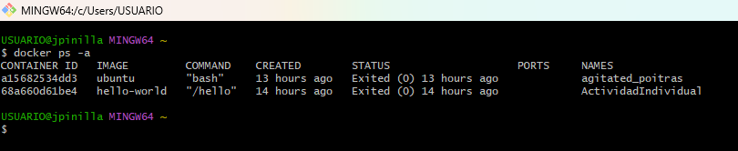
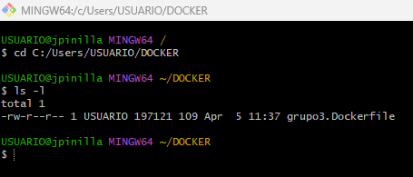

# Punto 1: Crear un repositorio en local y subirla al repositorio de Dockerhub, mediante el usos de la terminal.

## Paso 1
Se consulta los contenedores existentes usando el comando 
```prompt
docker ps -a
```
<div align="center">
    
</div>

## Paso 2
A través de la terminal, nos ubicamos en el directorio donde se encuentra el fichero HolaMundo.Dockerfile 
```prompt
docker ps -a
```
<div align="center">
    
</div>

## Paso 3

## Paso 4


# Punto 2: Crear repositorio directamente en Github siguiendo las buenas prácticas recomendadas por Dockerhub.

## Paso 1

## Paso 2

Se renombra la imagen del docker con el siguiente comando:

```prompt
docker tag [id imagen] [nombre usuario]/[nombre imagen]:[tag]
```

## Paso 3

Se inicia sesión en DockerHub con el siguente comando colocando el usuario y la contraseña correctamente:

```prompt
docker login -u [usuario] -password-stdin [contraseña]
```

## Paso 4

Se sube la imagen al repositorio online de docker:

```prompt
docker push [imagen]:[tag] 
```

## Integrantes :trollface:

| [<br><sub>Juliteth Pinilla</sub>](https://github.com/jpinillaDiplomado) | [<br><sub>Miguel Aponte</sub>](https://github.com/Miguelo89)  | [<br><sub>Andrés Gonzales </sub>](https://github.com/Andrezk8) |  
| :---: | :---: | :---: |
| [<br><sub>John Solorza </sub>](https://github.com/jsolorza) | [<br><sub>Sebastian Villa </sub>](https://github.com/SebastianVilla13) | [<br><sub>Leonardo Rondon </sub>](https://github.com/leonardoj27) |
