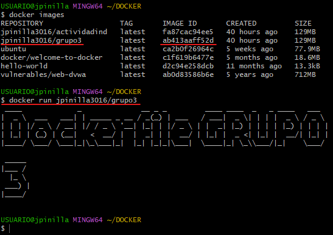

# Punto 1: Crear un repositorio en local y subirla al repositorio de Dockerhub, mediante el usos de la terminal.

## Paso 1
Se consulta los contenedores existentes usando el comando 
```prompt
docker ps -a
```
<div align="center">
    
</div>

## Paso 2
A través de la terminal, nos ubicamos en el directorio donde se encuentra el fichero **grupo3.Dockerfile** con el comando **cd**

<div align="center">
    
</div>

## Paso 3
Se ejecuta el comando **docker build** el cual se encarga de realizar la construcción de la imagen
```prompt
docker build -f grupo3.Dockerfile .
```
<div align="center">
    
</div>

Posteriormente se observa que la imagen se crea exitosamente pero sin etiqueta y versión.
<div align="center">
    
</div>

## Paso 4
Se ejecuta el comando **docker image tag** para agregar la etiqueta.
```prompt
docker image tag  ab413aaff52d jpinilla3016/grupo3:latest
```
<div align="center">
    
</div>

## Paso 5
Se inicia sesión en DockerHub usando el comando **docker login** ingresando el usuario y la contraseña correctamente:

```prompt
docker login -u [usuario] -p [contraseña]
```
<div align="center">
    
</div>

## Paso 6
Se sube la imagen al repositorio Online de Docker Hub:
```prompt
docker push [imagen]
```
<div align="center">
    
</div>

## Paso 7
Se visualiza el mensaje de la imagen con el siguiente comando:
```prompt
docker run [imagen]
```
<div align="center">
    
</div>

# Punto 2: Crear repositorio directamente en Github siguiendo las buenas prácticas recomendadas por Dockerhub.

## Paso 1
Creamos el repositorio en Docker Hub:

<div align="center">
    
</div>


## Paso 2
Establecemos un nombre, descripción y privacidad del repositorio:

<div align="center">
    
</div>


## Paso 3
Se realiza el push a la imagen:

```prompt
docker push miguelo89/grupo_3:tagname
```
<div align="center">
    
</div>


## Paso 4

Agregamos nombres de los participantes del repositorio:

<div align="center">
    
</div>


## Paso 5

Visualizamos la imagen:

```prompt
docker run [imagen]
```
<div align="center">
    
</div>

## Integrantes :trollface:

| [<br><sub>Juliteth Pinilla</sub>](https://github.com/jpinillaDiplomado) | [<br><sub>Miguel Aponte</sub>](https://github.com/Miguelo89)  | [<br><sub>Andrés Gonzales </sub>](https://github.com/Andrezk8) |  
| :---: | :---: | :---: |
| [<br><sub>John Solorza </sub>](https://github.com/jsolorza) | [<br><sub>Sebastian Villa </sub>](https://github.com/SebastianVilla13) | [<br><sub>Leonardo Rondon </sub>](https://github.com/leonardoj27) |
