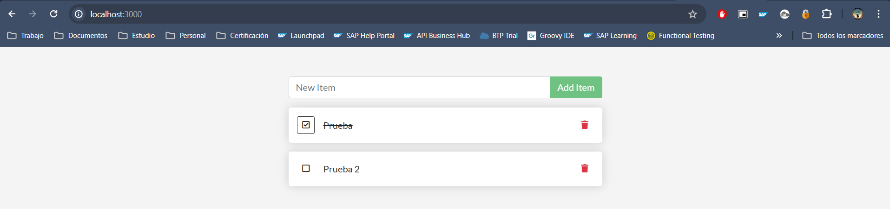
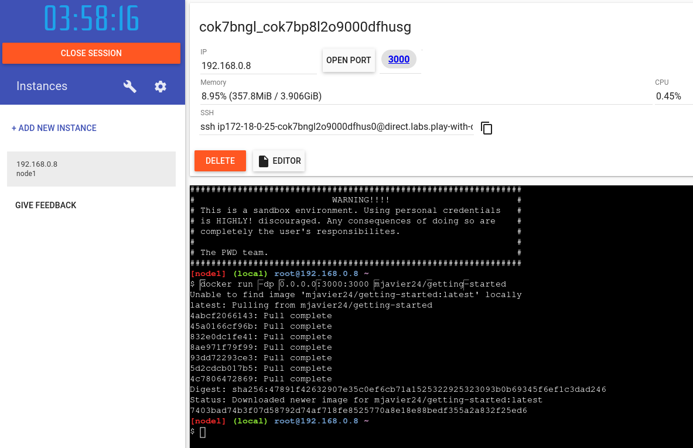

# <h1 align="center"> Contenerizar una aplicación </h1>

Integrantes:
 - Juan Peña - ID: 635668
 - Oscar Yela - ID: 433321
 - Maycol Javier Paez Rincon - ID: 751391
 - Brigitte Rodriguez - ID: 415800
 - Alvaro Adolfo Cote Sanchez - ID: 730352


# Paso 2: Contenerizar una aplicación
## Obtener la aplicación
1. Se clona el repositorio [getting-started-app](https://github.com/docker/getting-started-app/tree/main) usando el siguiente comando:

```
git clone https://github.com/docker/getting-started-app.git
```

Este comando se ejecuta desde una terminal y utiliza el protocolo git para clonar todos los archivos desde el repositorio de Github hacia la maquina local. Después de ejecutar este comando, existirá una carpeta llamada "getting-started-app" en el directorio donde se esta ubicado, que contiene todo el contenido del repositorio remoto.

 - **git clone**: Es el comando principal de Git que se utiliza para clonar un repositorio.
 - **https://github.com/docker/getting-started-app.git**: Es la URL del repositorio que se desea clonar. En este caso, es un repositorio hospedado en GitHub en la cuenta "docker" y el repositorio se llama "getting-started-app.git".


2. Se verifica el contenido del repositorio clonado.
```
	├── getting-started-app/
	│ ├── package.json
	│ ├── README.md
	│ ├── spec/
	│ ├── src/
	│ └── yarn.lock
```


## Construir la imagen de la aplicación.

Para generar la imagen deseada, es esencial contar con un Dockerfile. Este archivo, desprovisto de una extensión específica y conformado por texto simple, alberga un conjunto de instrucciones en forma de script. Dichas instrucciones proporcionan a Docker las directrices necesarias para construir una imagen de contenedor personalizada. En esencia, el Dockerfile actúa como un plano detallado que guía el proceso de construcción, desde la configuración del entorno hasta la instalación de dependencias y la ejecución de comandos específicos. Mediante este archivo, se especifica con precisión cómo se desea que el entorno del contenedor se configure y opere, permitiendo así la reproducibilidad y portabilidad de la aplicación en diferentes entornos de ejecución.

Los siguientes comandos fueron ejecutados en Windows en el terminal de Git Bash.

1. En el directorio `getting-started-app`, en la misma ubicación que el archivo `package.json`, se crea un archivo llamado `Dockerfile`.

```
cd /path/to/getting-started-app
```

Este comando se ejecuta desde una terminal para cambiar entre directorios. Esto significa que todos los comandos que se ejecuten después de este comando se ejecutarán en el contexto de ese directorio.

 - **cd**: Es el comando para cambiar de directorio.
 - **/path/to/getting-started-app**: Es la ruta al directorio "getting-started-app" en el sistema. Se debe reemplazar "/path/to" con la ruta real de la maquina local donde se descargo el repositorio en el paso anterior.


Cree un archivo vacío llamado Dockerfile.

```
touch Dockerfile
```

Este comando se utiliza para crear un archivo vacío o actualizar la marca de tiempo de un archivo existente.

- **touch**: Es el comando principal que se utiliza para crear un archivo vacío o actualizar la marca de tiempo de un archivo existente.
- **Dockerfile**: Es el nombre del archivo que se va a crear o actualizar. En este caso, el nombre del archivo es "Dockerfile".


2. Usando un editor de texto o editor de código, agregue el siguiente contenido al Dockerfile:

```
# syntax=docker/dockerfile:1

FROM node:18-alpine
WORKDIR /app
COPY . .
RUN yarn install --production
CMD ["node", "src/index.js"]
EXPOSE 3000
```

Este archivo es un script de texto plano que contiene unas instrucciones que Docker utiliza para construir una imagen.

 - **# syntax=docker/dockerfile:1**: Esta línea especifica la versión del formato del Dockerfile que se va a utilizar. En este caso, se está utilizando la versión 1.

 - **FROM node:18-alpine**: Esta línea especifica la imagen base que se utilizará para construir la nueva imagen. En este caso, la imagen base es node:18-alpine, que es una imagen ligera de Alpine Linux con Node.js instalado.

 - **WORKDIR /app**: Establece el directorio de trabajo dentro del contenedor Docker como /app. Todas las instrucciones siguientes se ejecutarán en este directorio.

- **COPY . .** : Copia todos los archivos y directorios del contexto de construcción (el directorio desde donde se ejecuta el comando docker build) al directorio de trabajo dentro del contenedor Docker (/app en este caso).

 - **RUN yarn install --production**: Ejecuta el comando `yarn install --production` dentro del contenedor Docker. Esto instalará las dependencias del proyecto utilizando Yarn, pero omitirá las dependencias de desarrollo (--production).

 - **CMD ["node", "src/index.js"]**: Establece el comando predeterminado que se ejecutará cuando se inicie un contenedor basado en esta imagen. En este caso, ejecutará el archivo index.js que se encuentra en la carpeta src utilizando Node.js.

 - **EXPOSE 3000**: Expone el puerto 3000 del contenedor Docker. Esto permite que los contenedores basados en esta imagen acepten conexiones en el puerto 3000 cuando se ejecuten.


3. Construya la imagen usando el siguiente comando:

```
docker build -t getting-started .
```

Este comando se utiliza para construir una imagen Docker a partir de un Dockerfile y los archivos presentes en el directorio actual.

 - **docker build**: Este es el comando principal de Docker utilizado para construir imágenes Docker.
 - **-t getting-started**: La opción -t se emplea para asignar una etiqueta a la imagen en construcción, proporcionándole un nombre y, opcionalmente, un tag. En este contexto, la imagen está siendo etiquetada como "getting-started".
 - **.** : Esto especifica el contexto de construcción. En este caso, el punto (.) significa que el contexto de construcción es el directorio actual en el que se está ejecutando el comando. Todos los archivos y directorios en este directorio serán considerados por Docker durante el proceso de construcción de la imagen.


## Iniciar un contenedor de aplicaciones

Ahora que tiene una imagen, puede ejecutar la aplicación en un contenedor usando el comando `docker run`.

1. Se ejecuta el contenedor usando el nombre de la imagen que se acaba de crear:

```
docker run -dp 127.0.0.1:3000:3000 getting-started
```

Este comando se utiliza para ejecutar un contenedor Docker a partir de una imagen Docker existente.

 - **docker run**: Este es el comando principal de Docker utilizado para ejecutar contenedores Docker.
 - **-d**: (`--detach`) Esta opción ejecuta el contenedor en modo "detach". Esto significa que el contenedor se ejecutará en segundo plano y no bloqueará la terminal.
 - **-p 127.0.0.1:3000:3000**: (`--publish`) Esta opción mapea el puerto 3000 del contenedor al puerto 3000 de la interfaz de red del host (127.0.0.1). Esto significa que cualquier tráfico que llegue al puerto 3000 de la máquina host se redirigirá al puerto 3000 del contenedor. Utilizar 127.0.0.1 restringe la conexión solo a la interfaz de loopback del host.
 - **getting-started**: Este es el nombre de la imagen Docker que se utilizará para ejecutar el contenedor.


2. Abrimos en el navgador http://localhost:3000 . Se verifica que la aplicación se este ejecutando.


3. Se agregan elementos para comprobar que funciona. Se marcan  elementos como completos y se eliminan.



## Validar si el contenedor se esta ejecutando

Ejecute el siguiente comando `docker ps` en una terminal para enumerar sus contenedores.

```
docker ps
```
Este comando es fundamental para obtener una visión instantánea de los contenedores activos en el entorno Docker actual. Al ejecutarlo, se despliega una lista que incluye el ID del contenedor, su nombre, el ID de la imagen subyacente, su estado actual y los puertos que están siendo expuestos. Esta información es crucial para supervisar el estado y la actividad de los contenedores en tiempo real, lo que facilita la administración y el diagnóstico de cualquier problema que pueda surgir.


# Paso 3: Actualizar la aplicación
## Actualizar el código fuente

En los siguientes pasos, cambiará el "texto vacío" cuando no tenga ningún elemento de la lista de tareas pendientes a "¡Aún no tiene elementos de tarea pendiente! ¡Agregue uno arriba!".

1. En el archivo `src/static/js/app.js`, se actualiza la línea 56 para usar el nuevo texto.


2. Se crea una versión actualizada de la imagen usando el comando `docker build`.

```
docker build -t getting-started .
```

Esta comando ya se explico previamente


3. Inicie un nuevo contenedor usando el código actualizado.

```
docker run -dp 127.0.0.1:3000:3000 getting-started
```
Aparecerá un error como el siguiente:


Este error ocurre cuando Docker intenta exponer un puerto en un contenedor, pero el puerto especificado ya está siendo utilizado por otro proceso en el host local.

 - **docker**: Esto indica que el error proviene del demonio de Docker.
 - **Error response from daemon**: Indica que el demonio de Docker respondió con un error.
 - **driver failed programming external connectivity on endpoint competent_swartz (cf8e5c2567085497271ed6ddb5ffd1fa5752376b72c7bb38807cfeb0b210e23a)**: Esto describe que el error ocurrió mientras Docker intentaba configurar la conectividad externa para un contenedor específico, identificado por su nombre o ID.
 - **Bind for 127.0.0.1:3000 failed: port is already allocated**: Aquí está la causa principal del error. Docker intenta asignar el puerto 3000 en la interfaz loopback (127.0.0.1) para el contenedor, pero ese puerto ya está en uso por otro proceso en el sistema.

## Retire el contenedor viejo.

Antes de eliminar un contenedor, es fundamental detenerlo para asegurar la terminación ordenada de sus procesos. Una vez detenido, se puede proceder con seguridad a su eliminación, liberando así los recursos asignados. Es importante recordar que la eliminación del contenedor no afecta a la imagen subyacente, que permanece disponible para futuros usos.

1. Obtenga el ID del contenedor mediante el comando `docker ps`.
```
docker ps
```


2. Utilice el comando `docker stop` para detener el contenedor. Reemplace `<the-container-id>` con el identificador del contenedor obtenido en el paso anterior.
```
docker stop <the-container-id>
```

Este comando se utiliza para detener un contenedor Docker en ejecución

 - **docker stop**: Esto indica que queremos detener un contenedor Docker.
 - **`<the-container-id>`**: En este espacio, se debe especificar el ID del contenedor que desea detener.


3. Una vez que el contenedor se haya detenido, puede eliminarlo usando el comando `docker rm`.
```
docker rm <the-container-id>
```

Este comando se utiliza para eliminar un contenedor Docker que ya no está en ejecución.
 - **docker rm**: Esto indica que queremos eliminar un contenedor Docker.
 - **`<the-container-id>`**: En este espacio, se debe especificar el ID del contenedor que desea eliminar.


## Inicie el contenedor de aplicaciones actualizado

Se inicia la aplicación actualizada usando el comando `docker run`.
```
docker run -dp 127.0.0.1:3000:3000 getting-started
```


Se actualiza la pagina en el navegador y se ve el texto de ayuda actualizado.


# Paso 4: Compartir la aplicación
## Subir la imagen creada al servidor de docker hub

Ahora que esta creada la imagen docker, ahora se puede compartir la imagen. Para compartir imágenes de Docker, se debe usar un Docker registro. El registro predeterminado es Docker Hub y es de donde proceden todas las imágenes que ha usado.

## Crear un repositorio
1. Se crea cuenta y se inicia sesion.
   


2. Seleccione el botón Crear repositorio. Para el nombre del repositorio, use . Asegúrese de que la visibilidad sea pública.getting-started en este caso, seleccione Crear en la pagina.


3. Subir (Empujar) la imagen: En la línea de comandos, ejecute el comando que ve en Docker Concentrador. Tenga en cuenta que su comando tendrá su ID de Docker, no "docker". Por ejemplo. `docker push docker push YOUR-USER-NAME/getting-started`.


pero la subida de la imagen falla, esto puede ser pot varias razones:

*La imagen con la etiqueta docker/getting-started no exista localmente en tu sistema. Se puede verificar esto ejecutando `docker images` para listar todas las imágenes locales.

*No haber iniciado sesión en Docker Hub utilizando el comando docker login. Si no has iniciado sesión, Docker no te permitirá subir imágenes.

*Que la etiqueta de la imagen sea correcta. Si la imagen se llama de manera diferente o tiene una etiqueta diferente, se debe usar esa etiqueta en lugar de `docker/getting-started`


4.Ejecución de la imagen en una nueva instancia: Ahora que la imagen se ha compilado e insertado en un registro, se puede ejecutar la aplicación en una marca nueva instancia que nunca ha visto esta imagen de contenedor. Para ello, usará Play with docker.

*Se selecciona el inicio de sesión y, a continuación, se selecciona Docker en la lista desplegable.

*Se inicia sesión con su cuenta de Docker Hub y, a continuación, seleccione Iniciar.

*Seleccione la opción AGREGAR NUEVA INSTANCIA en la barra lateral izquierda. Si no lo ves, haz que tu navegador sea un poco más ancho. Después de unos segundos, se abre una ventana de terminal en su navegador.



*Se ejecuta el comando `docker run -dp 0.0.0.0:3000:3000 YOUR-USER-NAME/getting-started`


# Paso 5: **Compartir la aplicación**

##El sistema de archivos del contenedor

Cuando se ejecuta un contenedor, utiliza las distintas capas de una imagen para su sistema de archivos. Cada contenedor también tiene su propio "espacio temporal" para crear,actualizar o eliminar archivos. Cualquier Los cambios no se verán en otro contenedor, incluso si usan la misma imagen.

Para ver esto en acción, se inicia dos contenedores. En un contenedor, creará un archivo. En el otro contenedor, comprobará que el archivo existe. Lo que verá es que el archivo creado en un contenedor no está disponible en otro.

1. Se inicia un contenedor de alpine y acceda a su caparazón.

2. En el contenedor, cree un archivo con dentro `greeting.txthello`


3. Ejecute un nuevo contenedor de Alpine y utilice el comando para verificar que el El archivo no existe `cat`


4. Se tiene que eliminar el contenedor con los comandos `docker ps --all` y `docker rm -f <container-id>`


#Volúmenes de contenedores

Con el experimento anterior, se vio que cada contenedor comienza desde la definición de la imagen cada vez que se inicia. Aunque los contenedores pueden crear, actualizar y eliminar archivos, esos cambios se pierden cuando se quita el contenedor y Docker aísla todos los cambios en ese contenedor. Con los volúmenes, puedes cambiar todo esto.

Los volúmenes proporcionan la capacidad de conectar rutas de acceso específicas del sistema de archivos de el contenedor de vuelta a la máquina host. Si monta un directorio en el contenedor, los cambios en ese directorio también se ven en la máquina host. Si monta ese mismo directorio en los reinicios de contenedores, verá los mismos archivos.

#Conservar los datos de tareas pendientes

De forma predeterminada, la aplicación de tareas pendientes almacena sus datos en una base de datos SQLite en el sistema de archivos del contenedor. Si no estás familiarizado con SQLite, Si bien esto no es lo mejor para aplicaciones a gran escala, Funciona para pequeñas demostraciones. Aprenderá a cambiar esto a un motor de base de datos diferente más adelante. `/etc/todos/todo.db`

##Creación de un volumen e inicio del contenedor

1. Cree un volumen mediante el comando.
```
docker volume create todo-db
```


2. Detenga y quite el contenedor de tareas pendientes de la aplicación una vez más con , ya que todavía se está ejecutando sin usar el volumen persistente. `docker rm -f <id>`

3. Inicie el contenedor de tareas pendientes de la aplicación, pero agregue la opción de especificar un Montaje de volumen.
```
docker run -dp 127.0.0.1:3000:3000 --mount type=volume,src=todo-db,target=/etc/todos getting-started
```

##Compruebe que los datos persisten

Una vez que se inicie el contenedor, abra la aplicación y agregue algunos elementos a la lista de tareas pendientes.


