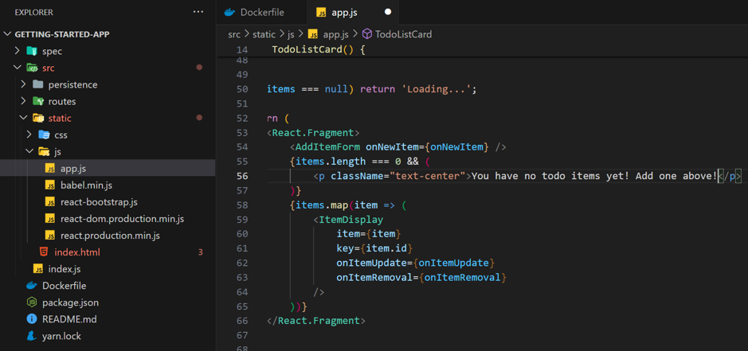
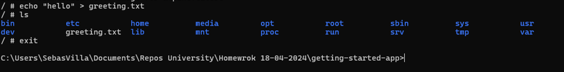
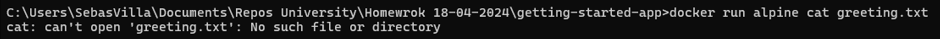

# CONTENERIZAR UNA APLICACION

## Paso 1:

Para subir la aplicación a un contenedor Docker se primero que se necesita es el proyecto para subir, por esto en este caso se va a usar un repositorio de pruebas de Docker.

Para clonar el repositorio no ubicamos en una carpeta donde se quiera guardar el proyecto y usamos el siguiente comando por consola:

``` git
    git clone https://github.com/docker/getting-started-app.git
```

Al finalizar el proceso de clonado se deberá ver en consola un mensaje como este:

<div style="width: 100%; text-align: center;">
    
</div>

## Paso 2:

Con un IDE para editar archivos de texto plano o binarios como lo es `Visual Studio Code` se abre el proyecto y se deberá tener una estructura de carpetas como esta:

<div style="width: 100%; text-align:center;">
    
</div>

En la carpeta raíz del proyecto que se llama getting-started-app debemos crear un archivo `Dockerfile`. Se puede crear desde consola o desde la propia interfaz del IDE usado

El proceso por consola sería el siguiente: 

1.	Nos aseguramos de estar dentro de la carpeta del proyecto:

<div style="width: 100%; text-align: center;">
    
</div>

2.	Y creamos un nuevo archivo Dockerfile con el siguiente comando:

``` docker
    type nul > Dockerfile
```

3. Deberá generar el archivo como se muestra a continuación:

<div style="width: 100%; text-align: center;">
    
</div>

Con el editor de texto editamos el archivo creado y escribimos las siguientes líneas de código dadas en sintaxis de Docker y lo guardamos:

``` docker
    FROM node:18-alpine
    WORKDIR /app
    COPY . .
    RUN yarn install --production
    CMD ["node", "src/index.js"]
    EXPOSE 3000
```

## Paso 3:

Ahora es el momento de construir la imagen que se va descargar a partir de los comando que insertamos en el paso anterior con el siguiente comando:

``` docker
    docker build -t getting-started .
```

Esto comenzará contruir la imagen y a descargar directamente desde DockerHub la imagen `node:18-alpine` que especificamos en la primera línea del archivo y va a realizar la copia generando en la consola la visualización del proceso de descarga de esta:

<div style="width: 100%; text-align: center;">
    
</div>

## Paso 4:

Una vez finalizada la descarga de la imagen vamos a correrla en un contenedor enviándole como parámetros los puertos por los que nos vamos a poder comunicar con la aplicación con el siguiente comando:

``` docker
    docker run -dp 127.0.0.1:3000:3000 getting-started
```

En este comando se puede visualizar la ruta localhost con su puerto respectivo `127.0.0.1:3000` y a continuación su puerto de exposición para la comunicación desde afuera con el `:3000.`

Una vez ejecutado el comando va a generar un hash es cual va a ser el id del contenedor el cual va a contener la imagen y la aplicación que acabamos de implementar:

<div style="width: 100%; text-align: center;">
    
</div>

Con el comando de Docker ps vamos a poder ver ese contenedor listado:

``` docker
    docker ps
```

<div style="width: 100%; text-align: center;">
    
</div>

Como ya estamos seguros de que el contenedor existe y tenemos el puerto `3000` expuesto para el consumo por medio de la ip de localhost, desde el navegador vamos a entrar a la siguiente ruta `http://localhost:3000` para visualizar lo siguiente:

<div style="width: 100%; text-align: center;">
    
</div>


# ACTUALIZACIÓN DE LA APLICACIÓN

## Paso 1:
Para esta parte se va a realizar la edición del archivo src/static/js/app.js en la línea 56, en donde vamos a cambiarla por los siguiente:

Antes: 
<div style="width: 100%; text-align: center;">
    
</div>


Ahora:

<div style="width: 100%; text-align: center;">
    
</div>

Una vez guardados los cambios realizamos el paso 3 y el paso 4 de la anterior sección:
1.	Construimos la imagen
docker build -t getting-started .
2.	Ejecutamos el contenedor:
docker run -dp 127.0.0.1:3000:3000 getting-started
Nos va a salir un error parecido a este:

<div style="width: 100%; text-align: center;">
    
</div>

Esto se debe a que como estamos generando otro contenedor con el mismo puerto y nombre al que ya tenemos encuentra un conflicto y no nos permite crear el nuevo contenedor. Para arreglar este problema vamos a para el contenedor actual y a eliminarlo para poder crear el nuevo con los cambios que realizamos:

## Paso 2:
Para eliminar un contendor vamos a copiar el id de este a detener su ejecución con el siguiente comando reemplazando el <the-container-id> por el id que copiamos:

``` docker stop <the-container-id>``` 

Y el resultado sería algo parecido a esto

<div style="width: 100%; text-align: center;">
    
</div>

Una vez detenido el contenedor lo removemos con el siguiente comando nuevamente reemplazando el <the-container-id> con el id que copiamos anteriormente:

```docker rm <the-container-id>```

Y al finalizar deberíamos obtener algo parecido como esto:

<div style="width: 100%; text-align: center;">
    
</div>

Si vemos la lista de los contenedores con el comando Docker ps ya no nos debería mostrar el contenedor creado anteriormente:

<div style="width: 100%; text-align: center;">
    
</div>

## Paso 3:

Para finalizar el proceso de actualización ahora solo queda correr el comando para correr el contenedor con los nuevos cambios:

docker run -dp 127.0.0.1:3000:3000 getting-started

Se creará otro contenedor nuevo:
 
<div style="width: 100%; text-align: center;">
    
</div> 

Y volvemos a revisar la pagina en la dirección http://localhost:3000 refrescandola para poder visualizar los cambios realizados:
 
<div style="width: 100%; text-align: center;">
    
</div>


# COMPARTIR LA APLICACIÓN

## Paso 1:

Para realizar un push hacia el repositorio de nuestra cuenta de DockerHub es necesario primero iniciar sesión, para esto utilizamos el siguiente comando cambiando YOUR-USER-NAME por el nombre de usuario de la cuenta de docker:

docker login -u YOUR-USER-NAME

Una vez iniciada sesión debería aparecer un mensaje como se muestra a continuación:

<div style="width: 100%; text-align: center;">
    
</div>

Vamos a listar las imágenes para revisar la imagen que vamos a subir al repositorio con el siguiente comando:

docker image ls

Y se verían las imágenes de la siguiente manera:

<div style="width: 100%; text-align: center;">
    
</div>

Como se puede evidenciar la imagen creada anteriormente se encuentra listada entre las demás imágenes pero todavía no es posible subirla al repositorio ya que causaría conflictos con la seguridad de Docker.

Para poder subir la imagen al repositorio existe una nomenclatura que se debe seguir al nombrar las imágenes para que Docker sepa hacia donde enviarla, esta nomenclatura es la siguiente:

[NombreUsuario]/[NombreImagen]

Por lo tanto se debe realizar el cambio de nombre de la imagen para poder continuar con el procesos, se va usar el siguiente comando:

docker tag getting-started YOUR-USER-NAME/getting-started

Donde vamos a cambiar YOUR-USER-NAME por el nombre de usuario de nuestra cuenta y debería salir un mensaje como este:

<div style="width: 100%; text-align: center;">
    
</div>

Una vez cambiamos el nombre de la imagen ahora procedemos a realizar el push hacia el repositorio con el siguiente comando:

docker push YOUR-USER-NAME/getting-started

Para que se muestre en consola algo como esto:

<div style="width: 100%; text-align: center;">
    
</div>

Al revisar en el repositorio de la página web de DockerHub podremos ver el repositorio que se subió:

<div style="width: 100%; text-align: center;">
    
</div>  

# PERSISTENCIA EN CONTENEDORES

Cuando se trabaja con varios o instalando y desinstalando contenedores, un problema muy común es el tema de la persistencia de los datos ya que los contenedores no retienen información, pero existe una solución los cuales son los volúmenes.

Para realizar las pruebas de que no se mantiene persistencia de datos vamos a realizar la construcción de dos contenedores:

## Paso 1:

Iniciar al contenedor alpine y accedemos al terminar 

docker run -ti --name=mytest alpine

<div style="width: 100%; text-align: center;">
    
</div>

Creamos el siguiente archive dentro del contenedor y salimos del contenedor

/ # echo "hello" > greeting.txt

/ # exit

<div style="width: 100%; text-align: center;">
    
</div>

Ahora vamos a correr otro contenedor abriendo el archivo creado anteriormente

docker run alpine cat greeting.txt

Al correr este comando vamos a ver un mensaje como el siguiente que indica que en este nuevo contenedor no existe el archivo
 
<div style="width: 100%; text-align: center;">
    
</div>

Ya viendo que no persisten los datos entre contenedores ahora vamos a proceder a crear un volumen para esta persistencia:

docker volume create todo-db

<div style="width: 100%; text-align: center;">
    
</div>

Iniciamos la app añadiendo una opción para especificar el volumen creado:

docker run -dp 127.0.0.1:3000:3000 --mount type=volume, src=todo-db,target=/etc/todos getting-started

<div style="width: 100%; text-align: center;">
    
</div>

Ahora es momento de probar la persistencia del volumen configurado en el contenedor que acabamos de correr, para esto desde localhost:3000 añadimos unos elementos y eliminamos el contenedor:

### 1.	Añadimos elementos:

<div style="width: 100%; text-align: center;">
    
</div>
 

### 2.	Ahora eliminamos el contenedor con el siguiente comando donde reemplazamos <id> por el id del contenedor:

docker rm -f <id>

<div style="width: 100%; text-align: center;">
    
</div> 

### 3.	Y volvemos a crear el contenedor como lo realizamos al principio y deberíamos ver en la página los ítems creados:

docker run -dp 127.0.0.1:3000:3000 --mount type=volume, src=todo-db,target=/etc/todos getting-started

<div style="width: 100%; text-align: center;">
    
</div> 

<div style="width: 100%; text-align: center;">
    
</div>

Paso 4:

Para inspeccionar el volumen creado y ver su información se usa el siguiente comando:

docker volume inspect todo-db 

De esta manera veremos una estructura de datos como esta con la información respectiva del volumen:
 
<div style="width: 100%; text-align: center;">
    
</div>

# MONTAJES DE ENLACES 

Un montaje de enlaces es otro tipo de montaje con el que se puede compartir datos desde el sistema principal con el contenedor, este montaje puede detectar los cambios realizados en los archivos al instante.

Para ver como funcionan estos montajes se va a hacer una prueba con el proyecto getting-started-app que ya se ha venido trabajando anteriormente.

## Paso 1:

En la consola nos vamos a dirigir hacia el directorio getting-started-app y vamos a ejectuar el siguiente comando:

docker run -it --mount "type=bind,src=%cd%,target=/src" ubuntu bash

La opcion –-mount type= bind permite a docker identificar cual es el tipo de montaje que necesitamos, en este caso es el de tipo de enlaces y src es el directorio actual del proyecto.

Una vez ejecutado el comando se va a mostrar algo como esto:

<div style="width: 100%; text-align: center;">
    
</div> 

Como se puede ver ya estamos dentro del bash del contenedor Ubuntu que ejecutamos, ahora es necesario saber donde esta el directorio src y navegar hacia el:

<div style="width: 100%; text-align: center;">
    
</div>
 
Creamos un nuevo archivo llamado myfile.txt:

<div style="width: 100%; text-align: center;">
    
</div>

Y en el directorio del sistema principal es decir el host, también se debe mostrar el archivo que se creó desde el contenedor:

<div style="width: 100%; text-align: center;">
    
</div>


Pero no solo funciona del contenedor hacia el host, sino también en la dirección contraria, de host hacia el contenedor. Vamos a eliminar el archivo que creamos desde el host y veremos que en el contenedor ya no se encuentra:

<div style="width: 100%; text-align: center;">
    
</div> 

<div style="width: 100%; text-align: center;">
    
</div> 
