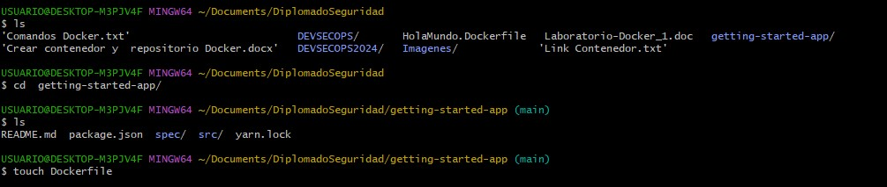
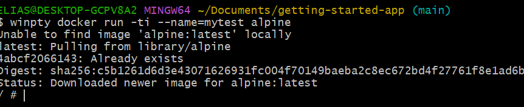

# Grupo 6

- David Medina - 424738
- Felipe Sánchez - 611390
- Elias Acuña - 710154
- Juan Felipe Sánchez - 594066
- Brayan Andres Lara - 728895

# 1. Descripción general 

<p align="center">
  
</p>

Esta guía contiene instrucciones paso a paso sobre cómo empezar a utilizar Docker. Esta guía le muestra cómo:
- Cree y ejecute una imagen como contenedor.
- Comparta imágenes usando Docker Hub.
- Implemente aplicaciones Docker utilizando varios contenedores con una base de datos.
- Ejecute aplicaciones usando Docker Compose.

## ¿Qué es un contenedor?

Un contenedor es un proceso aislado que se ejecuta en una máquina host que está aislada de todos los demás procesos que se ejecutan en esa máquina host. Ese aislamiento aprovecha los espacios de nombres del kernel y los cgroups , características que han estado en Linux durante mucho tiempo. Docker hace que estas capacidades sean accesibles y fáciles de usar. En resumen, un contenedor:

- Es una instancia ejecutable de una imagen. Puede crear, iniciar, detener, mover o eliminar un contenedor mediante la API o CLI de Docker.
- Puede ejecutarse en máquinas locales, máquinas virtuales o implementarse en la nube.
- Es portátil (y puede ejecutarse en cualquier sistema operativo).
- Está aislado de otros contenedores y ejecuta su propio software, binarios, configuraciones, etc.
- Si está familiarizado con chroot, piense en un contenedor como una versión extendida de chroot. El sistema de archivos proviene de la imagen. Sin embargo, un contenedor agrega aislamiento adicional que no está disponible cuando se usa chroot.

## ¿Qué es una imagen?
Un contenedor en ejecución utiliza un sistema de archivos aislado. Este sistema de archivos aislado lo proporciona una imagen, y la imagen debe contener todo lo necesario para ejecutar una aplicación: todas las dependencias, configuraciones, scripts, archivos binarios, etc. La imagen también contiene otras configuraciones para el contenedor, como variables de entorno, un comando predeterminado ejecutar y otros metadatos.


# 2. Contenerización de una aplicación
En esta practica, se procederá a contenerizar una aplicación. Durante el proceso, se trabajará con un gestor de listas de tareas básico que opera en Node.js.


## Requisitos

* Se debe tener instalada la última versión de Docker Desktop.
* Se ha de contar con un cliente Git instalado.
* Se necesita un IDE o editor de texto para editar archivos. Docker recomienda el uso de Visual Studio Code.
  
En resumen, se empaquetará la aplicación utilizando Docker y se trabajará con ella utilizando las herramientas mencionadas anteriormente.

## Obtener la aplicación

1. Clonar el repositorio getting-started-app usando el comando:

```
git clone https://github.com/docker/getting-started-app.git
``` 
<p align="center">
  
</p>

2. Ver el contenido del repositorio clonado. Debería ver los siguientes archivos y subdirectorios

<p align="center">
  
</p>

## Construir la imagen de la aplicación

Un Dockerfile es como una receta de cocina para crear una imagen de contenedor. Es un archivo de texto que contiene una serie de instrucciones que Docker utiliza para construir automáticamente una imagen Docker. Especifica qué software y configuraciones se deben incluir en la imagen, así como cómo se deben configurar y ejecutar. Una vez que tienes un Dockerfile, Docker puede usarlo para construir una imagen de contenedor de manera consistente y reproducible.

1. Entrar en el repositorio clonado y crear un archivo vacío llamado Dockerfile
   
| cd /path/to/getting-started-app |
|-------------------------------------------------------------|
   
| touch Dockerfile |
|-------------------------------------------------------------|
  
<p align="center">
  
</p>

2. En un editor de codigo agregamos el siguiente codigo al archivo Dockerfile

<p align="center">
  
</p>

3. Se construye la imagen usando el comando:

| docker build -t getting-started . |
|-----------------------------------|

<p align="center">
  
</p>

<p align="center">
  
</p>

Cuando se ejecuta el comando `docker build`, Docker utiliza el Dockerfile proporcionado para construir una nueva imagen. Si la imagen base especificada en el Dockerfile no está disponible localmente, Docker la descarga automáticamente. Luego, Docker sigue las instrucciones del Dockerfile, copiando los archivos de la aplicación, instalando dependencias (en este caso, usando `yarn`), y configurando el comando predeterminado que se ejecutará al iniciar un contenedor a partir de esta imagen (especificado por la directiva `CMD`).

La bandera `-t` permite etiquetar la imagen con un nombre que elijas, haciéndola fácilmente identificable. En este caso, la imagen se etiqueta como "getting-started". Al final del comando, el "." indica que Docker debe buscar el Dockerfile en el directorio actual.

El comando `docker build` utiliza el Dockerfile para construir una imagen de contenedor, siguiendo las instrucciones especificadas en el Dockerfile y etiquetando la imagen resultante para facilitar su identificación.

## Iniciar un contenedor de aplicaciones

1. Ejecutar el comando:

| docker run -dp 127.0.0.1:3000:3000 getting-started |
|----------------------------------------------------|

<p align="center">
  
</p>

<p align="center">
  
</p>

La bandera `-d` (abreviatura de --detach) ejecuta el contenedor en segundo plano, lo que significa que Docker inicia el contenedor y lo devuelve al indicador de terminal. Se puede verificar que un contenedor esté en ejecución visualizándolo en Docker Dashboard en Containers o ejecutando `docker ps` en la terminal.

La bandera `-p` (abreviatura de --publish) crea una asignación de puertos entre el host y el contenedor. Toma un valor de cadena en el formato HOST:CONTAINER, donde HOST es la dirección en el host y CONTAINER es el puerto en el contenedor. El comando publica el puerto 3000 del contenedor en 127.0.0.1:3000 (localhost:3000) en el host. Sin la asignación de puertos, no se puede acceder a la aplicación desde el host.

2. Abrir en el navegador web el enlace:

| http://localhost:3000/ |
|------------------------|

Al agregar uno o dos elementos y verificar que funcione según lo esperado, se puede confirmar que la interfaz está almacenando los elementos correctamente en el backend. Esto implica ingresar los elementos en la interfaz, verificar que se guarden correctamente en el backend y luego confirmar su presencia en la interfaz nuevamente.

Una vez que se han agregado los elementos, se puede marcar esta tarea como completa y eliminarla para mantener un registro ordenado del progreso.

<p align="center">
  
</p>

Ejecutar el siguiente comando en una terminal para enumerar sus contenedores.

| docker ps |
|------------------------|

# 3. Actualizar la aplicación
En esta sección, se procederá a actualizar tanto la aplicación como la imagen asociada. Además, se aprenderá a detener y eliminar un contenedor en ejecución.

## Actualizar el código fuente
1. En el src/static/js/app.jsarchivo, se actualiza la línea 56.
   
<p align="center">
  
</p>

2. Crear la versión actualizada de la imagen. 

3. Inicie un nuevo contenedor usando el código actualizado.

| docker run -dp 127.0.0.1:3000:3000 getting-started |
|------------------------|

## Eliminar el contenedor creado anteriormente

1. Obtener el ID del contenedor con el comando:

| docker ps |
|-----------|

2. Utilizar el docker stopcomando para detener el contenedor. Reemplazar <the-container-id>con el CONTAINER ID.

| docker stop <the-container-id> |
|--------------------------------|

<p align="center">
  
</p>

<p align="center">
  
</p>

3. Eliminar el contenedor detenido

<p align="center">
  
</p>

## Iniciar el contenedor de aplicaciones actualizado

1. Usar docker run para iniciar el contenedor
   
<p align="center">
  
</p>

<p align="center">
  
</p>

2. Abrir en el navegador web el enlace:
   
| http://localhost:3000/ |
|------------------------|

Se observa el cambio en el texto de la aplicación

 ### Antes
<p align="center">
  
</p>

 ### Despues
 <p align="center">
  
</p>

# 4. Compartir la aplicación 
Ahora que ha creado una imagen, puede compartirla. Para compartir imágenes de Docker, debe utilizar un registro de Docker. El registro predeterminado es Docker Hub y es de donde provienen todas las imágenes que ha utilizado.

### Crear un repositorio
Para enviar una imagen, primero debe crear un repositorio en Docker Hub.

1. Regístrese o inicie sesión en Docker Hub .
2. Seleccione el botón Crear repositorio .
3. Para el nombre del repositorio, utilice getting-started. Asegúrese de que la visibilidad sea pública .
4. Seleccione Crear .
   
   ## Crear repositorio y ponerlo publico
   <p align="center">
  
   </p>

## Push en la imagen

1. Este comando enviará a este repositorio.

| docker push docker/getting-started:tagname |
|------------------------|

2. Inicie sesión en Docker Hub usando el comando
   
| docker login -u YOUR-USER-NAME |
|------------------------|

3. Utilice el docker tagcomando para darle a la getting-startedimagen un nuevo nombre. Reemplácelo YOUR-USER-NAMEcon su ID de Docker.

|  docker tag getting-started YOUR-USER-NAME/getting-started |
|------------------------|


## Ejecute la imagen en una nueva instancia.

Ahora que su imagen se creó y se insertó en un registro, intente ejecutar su aplicación en una instancia nueva que nunca haya visto esta imagen de contenedor. Para hacer esto, utilizará Play with Docker.

| docker build --platform linux/amd64 -t YOUR-USER-NAME/getting-started . |
|------------------------|

1. Abra su navegador para Play with Docker.

2. Seleccione Iniciar sesión y luego seleccione la ventana acoplable en la lista desplegable.

3. Inicie sesión con su cuenta de Docker Hub y luego seleccione Iniciar .

4. Seleccione la opción AGREGAR NUEVA INSTANCIA en la barra lateral izquierda. Si no lo ve, amplíe un poco su navegador. Después de unos segundos, se abre una ventana de terminal en su navegador.

Ahora ejecute el docker pushcomando nuevamente. Si está copiando el valor de Docker Hub, puede descartar la tagnameparte, ya que no agregó una etiqueta al nombre de la imagen. Si no especifica una etiqueta, Docker usa una etiqueta llamada latest.

| docker push YOUR-USER-NAME/getting-started |
|------------------------|

   <p align="center">
  
   </p>

Se inicia la aplicación en un nuevo contenedor creado, con la imagen que se descargo del repositorio
  
| docker run -dp 0.0.0.0:3000:3000 YOUR-USER-NAME/getting-started |
|-----------------------------------------------------------------|   

<p align="center">
  
</p>

<p align="center">
  
</p>

   
6. En la terminal, inicie su aplicación recién enviada.

| docker run -dp 0.0.0.0:3000:3000 YOUR-USER-NAME/getting-started |
|------------------------|

6. Seleccione la insignia 3000 cuando aparezca.

Si la insignia 3000 no aparece, puede seleccionar Abrir puerto y especificar 3000.

   <p align="center">
  
   </p>


# 5. Persistir la base de datos
En caso de que no lo hayas notado, tu lista de tareas pendientes está vacía cada vez que inicias el contenedor. ¿Por qué es esto? En esta parte, profundizará en cómo funciona el contenedor.

## El sistema de archivos del contenedor.
Cuando se ejecuta un contenedor, utiliza las distintas capas de una imagen para su sistema de archivos. Cada contenedor también tiene su propio "espacio temporal" para crear/actualizar/eliminar archivos. Los cambios no se verán en otro contenedor, incluso si usan la misma imagen.

1. Para conservar la base de datos primero se debe iniciar un contenedor alpino y acceder a su caparazón con el siguiente comando:

| docker run -ti --name=mytest alpine |
|------------------------|
   <p align="center">
  
   </p>

   Como en este caso no reconoce el comando, se debe ejecutar mediante el siguiente:

| winpty docker run -ti --name=mytest alpine |
|------------------------|

De esta forma, el comando empezara la descarga
<p align="center">
  
   </p>


2. En el contenedor, cree un greeting.txtarchivo con helloel interior.

| echo "hello" > greeting.txt |
|------------------------|

3. Sal del contenedor.
| exit |
|------------------------|

Procedemos a crear el archivo greetings y posteriormente saldremos del contenedor

  <p align="center">
  
   </p>
 
  Nos saldra el siguiente error ya que  el archivo no existe en el nuevo contenedor.
   
  <p align="center">
  
   </p>
   
  Procederemos a ejecutar los siguientes comandos para eliminar los contenedores mediante su identificacion
   <p align="center">
  
   </p>
   
   <p align="center">
  
   </p>

  Ahora crearemos un nuevo volumen del contenedor para comprobar que los datos persisten

  <p align="center">
  
   </p>
4. Ejecute un nuevo contenedor Alpine y use el catcomando para verificar que el archivo no existe.
|  docker run alpine cat greeting.txt |
|------------------------|

5.Continúe y retire los contenedores usando docker ps --allpara obtener las identificaciones y luego docker rm -f <container-id>para quitar los contenedores.

## Volúmenes de contenedores
Con el experimento anterior, viste que cada contenedor comienza desde la definición de la imagen cada vez que comienza. Si bien los contenedores pueden crear, actualizar y eliminar archivos, esos cambios se pierden cuando elimina el contenedor y Docker aísla todos los cambios en ese contenedor. Con los volúmenes, puedes cambiar todo esto.

Los volúmenes brindan la capacidad de conectar rutas específicas del sistema de archivos del contenedor a la máquina host. Si monta un directorio en el contenedor, los cambios en ese directorio también se ven en la máquina host. Si monta ese mismo directorio al reiniciar el contenedor, verá los mismos archivos.

Hay dos tipos principales de volúmenes. Eventualmente usarás ambos, pero comenzarás con montajes de volumen.

   ## Datos de prueba 
   
  <p align="center">
  
   </p>

# 6. Usar montajes de enlace
En la parte 5 , utilizó un montaje de volumen para conservar los datos en su base de datos. Un montaje de volumen es una excelente opción cuando necesita un lugar persistente para almacenar los datos de su aplicación.

Un montaje vinculado es otro tipo de montaje, que le permite compartir un directorio desde el sistema de archivos del host en el contenedor. Cuando trabaja en una aplicación, puede utilizar un montaje de enlace para montar el código fuente en el contenedor. El contenedor ve los cambios que realiza en el código inmediatamente, tan pronto como guarda un archivo. Esto significa que puede ejecutar procesos en el contenedor que detectan cambios en el sistema de archivos y responden a ellos.

En este capítulo, verá cómo puede usar montajes vinculados y una herramienta llamada nodemon para observar los cambios en los archivos y luego reiniciar la aplicación automáticamente. Existen herramientas equivalentes en la mayoría de los demás lenguajes y marcos.

   ## Comparaciones rápidas de tipos de volumen

  Los siguientes son ejemplos de un volumen con nombre y un montaje vinculado usando `--mount`:

  - **Volumen nombrado:** `type=volume,src=my-volume,target=/usr/local/data`
  - **Montaje de enlace:** `type=bind,src=/path/to/data,target=/usr/local/data`

  Abra una terminal y cambie el directorio al getting-started-app directorio.

  <p align="center">
  
   </p>

  Para iniciar una sesión de bash en un contenedor Ubuntu con un montaje de enlace, proceda ejecutando el siguiente comando. La opción --mount type=bind instruye a Docker para establecer un montaje de enlace, permitiendo   la sincronización de directorios entre el sistema operativo anfitrión y el contenedor. En este caso, 'src' representa el directorio de trabajo actual en su máquina host, que en este contexto es el proyecto denominado     'getting-started-app'. Por otro lado, 'target' indica la ubicación dentro del contenedor donde se reflejará este directorio montado, en este caso, '/src'. Al ejecutar este comando, asegúrese de reemplazar 'src' y         'target' con las rutas correspondientes según su configuración específica.

  <p align="center">
  
   </p>

  Tras ejecutar el comando proporcionado, Docker abre una sesión interactiva de bash dentro del contenedor, colocándolo en el directorio raíz del sistema de archivos del contenedor. Esto significa que está directamente     dentro del entorno del contenedor, listo para interactuar con él utilizando comandos de bash. Desde este punto, puede explorar y trabajar dentro del entorno del contenedor según sea necesario para el proyecto o tarea     en curso.
  Después de ejecutar el comando, diríjase al directorio 'src'. Este es el directorio que se montó al iniciar el contenedor y muestra los mismos archivos que tiene en el directorio 'getting-started-app' de su máquina       host. Puede verificar esto listando el contenido del directorio utilizando el comando ls. Esto le permitirá confirmar que está trabajando con los archivos correctos y que el montaje de enlace se realizó correctamente.

  <p align="center">
  
  </p>

  Cree un nuevo archivo llamado myfile.txt.

  <p align="center">
  
  </p>

  Abra el getting-started-app directorio en el host y observe que el myfile.txt archivo está en el directorio.

  <p align="center">
  
  </p>

  Desde el host, elimine el myfile.txt archivo.

  <p align="center">
  
  </p>

  En el contenedor, visualice el contenido del app directorio una vez más. Observe que el archivo ya no está.

  <p align="center">
  
  </p>  

  ## Contenedores de desarrollo

  Los siguientes pasos detallan cómo ejecutar un contenedor de desarrollo con un montaje de enlace que realiza las siguientes acciones:

  - Monta su código fuente en el contenedor.
  - Instala todas las dependencias necesarias.
  - Inicia nodemon para observar los cambios en el sistema de archivos.

  Asegúrese de no tener ningún contenedor getting-started ejecutándose actualmente.

  Ejecute el siguiente comando desde el getting-started-app directorio.

  <p align="center">
  
  </p>

  - Para ejecutar el contenedor en modo independiente (en segundo plano) con una asignación de puertos, se utiliza la opción `-d -p 127.0.0.1:3000:3000`. Esto garantiza que el contenedor funcione en segundo plano y que     el puerto 3000 del contenedor esté mapeado al puerto 3000 del host.

  - Además, se establece el "directorio de trabajo" del contenedor utilizando la opción `-w //app`, lo que indica que el directorio actual desde donde se ejecuta el comando es `/app` dentro del contenedor.

  - Luego, se emplea la opción `--mount type=bind,src="/$(pwd)",target=/app` para enlazar y montar el directorio actual del host al directorio `/app` dentro del contenedor. Esto asegura que el código fuente del proyecto    esté disponible dentro del contenedor y se sincronice con los cambios realizados en el sistema de archivos del host.

  - La imagen base utilizada es `node:18-alpine`, que se especifica con el propósito de la aplicación según el Dockerfile.

  - Por último, el comando ejecutado dentro del contenedor es `sh -c "yarn install && yarn run dev"`. Aquí, se inicia un shell utilizando `sh` (ya que alpine no tiene bash) y se ejecutan los comandos `yarn install` para    instalar las dependencias del proyecto y `yarn run dev` para iniciar el servidor de desarrollo. Es importante mencionar que si se revisa el archivo `package.json`, se verá que el script `dev` inicia el servidor           utilizando `nodemon`.

  Los registros se pueden ver usando docker logs <container-id>. Sabrás que estás listo para comenzar cuando visualice esto:

  <p align="center">
  
  </p>

  ## Desarrolla tu aplicación con el contenedor de desarrollo

  En el src/static/js/app.jsarchivo, en la línea 109, cambie el botón "Agregar elemento" para que diga simplemente "Agregar":

  <p align="center">
  
  </p>
  <p align="center">
  
  </p>

  Actualice su página en el navegador web y notará que el cambio se refleja casi de inmediato gracias al montaje del enlace. Nodemon detectará el cambio y reiniciará el servidor automáticamente. Es posible que el           servidor de Node tarde unos segundos en reiniciar. Si encuentra algún error, inténtelo de nuevo después de unos segundos.

  <p align="center">
  
  </p>
  
  # APLICACIONES DE MULTIMPES CONTENEDORES

  Hasta este punto, el enfoque ha estado en trabajar con aplicaciones de contenedor único. Sin embargo, ahora se agregará MySQL a la pila de aplicaciones. Surge la pregunta: "¿Dónde debería ejecutarse MySQL? ¿Debería       instalarse en el mismo contenedor o ejecutarse de forma independiente?" En términos generales, cada contenedor debería cumplir una función específica y hacerlo de manera eficiente. Aquí hay algunas razones para           considerar la ejecución del contenedor de MySQL por separado:
  - Escalabilidad diferenciada: Es probable que necesite escalar las API y las interfaces de usuario de manera diferente a la base de datos. Mantener los contenedores separados facilita esta gestión y permite ajustar los 
    recursos según las necesidades específicas de cada componente.
  - Gestión de versiones: Al mantener la base de datos en un contenedor separado, puede versionarla y actualizarla de forma aislada. Esto garantiza un control más preciso sobre las actualizaciones y evita posibles            conflictos entre componentes de la aplicación.
  - Entorno de producción: Si bien puede ser conveniente utilizar un contenedor para la base de datos localmente durante el desarrollo, en un entorno de producción es posible que prefiera utilizar un servicio de base de      datos administrado. Separar la base de datos del resto de la aplicación le permite adaptarse fácilmente a diferentes entornos sin arrastrar consigo el motor de base de datos.
  - Complejidad de múltiples procesos: Ejecutar múltiples procesos dentro de un mismo contenedor puede complicar la gestión del ciclo de vida del contenedor. Se requerirá un administrador de procesos adicional, lo que        aumenta la complejidad del inicio y apagado del contenedor. Mantener los componentes en contenedores separados simplifica esta gestión y hace que el sistema sea más modular y fácil de mantener.

  ## Redes de contenedores
  
  Es importante recordar que los contenedores, por defecto, se ejecutan de forma aislada y no tienen conocimiento de otros contenedores en la misma máquina. La solución a esta limitación es la creación de redes. Al         colocar los contenedores en la misma red, se habilita la comunicación entre ellos. Esta práctica es fundamental para permitir que los contenedores se comuniquen de manera segura y eficiente.

  ## Iniciar MySQL
  
  Existen dos métodos para integrar un contenedor en una red:
  -	Asignar la red al iniciar el contenedor.
  -	Conectar un contenedor que ya está en ejecución a una red.
  En los próximos pasos, se creará la red primero y luego se asociará el contenedor MySQL al inicio.

	Crea la red.

  <p align="center">
  
  </p>

  Para comenzar, inicie un contenedor MySQL y conectelo a la red que ha creado. Además, definirá algunas variables de entorno que la base de datos utilizará para inicializar su configuración. Esto asegurará que el          contenedor MySQL esté configurado correctamente y pueda funcionar de manera óptima en su entorno.

  <p align="center">
  
  </p>

  Para confirmar que tiene la base de datos en funcionamiento, conéctese a la base de datos y verifique que se conecte.
  Cuando aparezca la solicitud de contraseña, escriba secret. En el shell MySQL, enumere las bases de datos y verifique que ve la base de datos todos.

  <p align="center">
  
  </p>

  Ahora tiene la base de datos todos y está lista para usar.

  ## Conéctate a MySQL

  Ahora que se sabe que MySQL está en funcionamiento, se puede comenzar a utilizar. Sin embargo, surge la pregunta: ¿Cómo se utiliza exactamente? Además, si se ejecuta otro contenedor en la misma red, ¿cómo se puede        encontrar el contenedor MySQL? Es importante recordar que cada contenedor tiene su propia dirección IP.
  
  Para responder a estas preguntas y profundizar en la comprensión de las redes de contenedores, se puede utilizar el contenedor "nicolaka/netshoot". Este contenedor viene equipado con numerosas herramientas que son        útiles para solucionar o depurar problemas relacionados con las redes. Su amplio conjunto de herramientas facilitará la exploración y el diagnóstico dentro del entorno de contenedores.
  
  Inicie un nuevo contenedor usando la imagen nicolaka/netshoot. Asegúrate de conectarlo a la misma red.

  <p align="center">
  
  </p>

  Dentro del contenedor, usará el comando dig, que es una herramienta DNS útil. Vas a buscar la dirección IP para el nombre de host mysql.

  <p align="center">
  
  </p>

  En la "SECCIÓN DE RESPUESTA", se observará que hay un registro A donde "mysql" se resuelve en 172.23.0.2 (es probable que la dirección IP sea diferente en su caso). Aunque "mysql" normalmente no sería un nombre de host   válido, Docker pudo resolverlo en la dirección IP del contenedor que tenía ese alias de red. Esto se debe al uso del --network-alias anterior.
  
  Lo que esto implica es que, para su aplicación, solo necesita conectarse a un host llamado "mysql" para comunicarse con la base de datos. Esta resolución facilita el proceso de conexión, ya que la aplicación puede        interactuar con la base de datos utilizando el nombre de host "mysql", en lugar de la dirección IP específica del contenedor.
  
  ## Ejecute su aplicación con MySQL

  La aplicación "todo" ofrece la posibilidad de configurar ciertas variables de entorno para especificar la configuración de conexión a MySQL. Estas variables son:
  - `MYSQL_HOST`: El nombre de host del servidor MySQL en ejecución.
  - `MYSQL_USER`: El nombre de usuario que se utilizará para la conexión.
  - `MYSQL_PASSWORD`: La contraseña que se utilizará para la conexión.
  - `MYSQL_DB`: El nombre de la base de datos que se utilizará una vez establecida la conexión.
  Ahora puede iniciar su contenedor listo para desarrollo.

  Asegúrese de estar en el directorio "getting-started-app" cuando ejecute este comando. Especifique cada una de las variables de entorno anteriores y conecte el contenedor a la red de su aplicación. Esto permitirá que     la aplicación "todo" se conecte correctamente a MySQL.

  <p align="center">
  
  </p>

  observamos los registros del contenedor ( docker logs -f <container-id>), debería ver un mensaje que indica que está usando la base de datos mysql.

  <p align="center">
  
  </p>

  Abra la aplicación en su navegador y agregue algunos elementos a su lista de tareas pendientes.

  <p align="center">
  
  </p>

## Usando Docker Compose

Docker Compose es una herramienta de orquestación de contenedores que facilita la definición, configuración y ejecución de aplicaciones multi-contenedor en entornos basados en Docker. Proporciona una interfaz simple y declarativa para gestionar la infraestructura de aplicaciones, permitiendo a los desarrolladores y administradores de sistemas especificar los componentes de la aplicación, sus dependencias y configuraciones en un único archivo YAML.
Para la configuración se deben seguir los siguientes pasos:

Sobre la ruta de la aplicación getting-started-app y por medio del comando vi compose.yaml, se creará el archivo .yaml que permitirá  alojar la configuración necesaria para que funcione correctamente 
<p align="center">
  
  </p>

Se realizan las configuraciones sobre el archivo .yaml
Agregando caracteristicas como configuración de puertos, se define el ambiente del compose entre otros.

<p align="center">
  
  </p>

  Se ejecuta el compose sin novedades
  
<p align="center">
  
  </p>

Se evidencia que el servicio responde desde navegador

<p align="center">
  
  </p>


## Buenas practicas Docker

Ejecutando el comando docker image history getting-started esto mostrará el historial de capas ejecutadas para la imagen


Todas estas capas se deben recrear en cada una de las veces que se requiera ejecutar la imagen lo que ralentizará el proceso de ejecución.
Para esto lo aconsejable es habilitar el almacenamiento del caché de estas capas para que no deba recrearlas en cada ejecución.
Se debe abrir el dockerfile y modificarlo de la siguiente manera


Y se realiza la creación del archivo .dockerignore


Y se construye nuevamente la imagen donde el proceso demora mucho menos y es exitoso.


